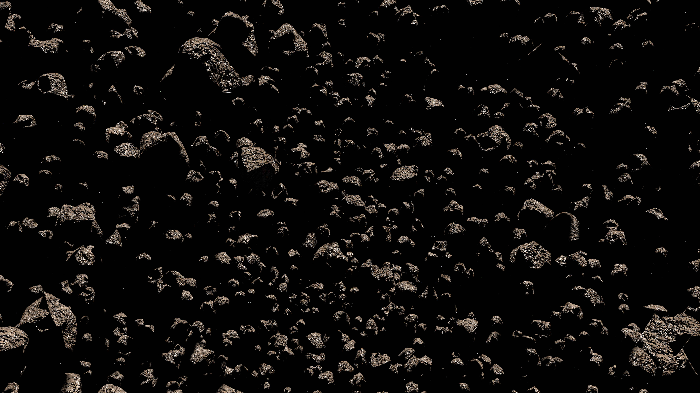

# Keep Calm, Captain!

A browser-based Asteroids-style arcade shooter built in p5.js, centred on a Stress mechanic that changes how the ship handles during play. Instead of treating damage as a simple health reduction, our game turns collisions into a controllability problem: taking hits raises the player’s Stress meter, and higher stress degrades ship handling in fixed, predictable tiers. This transforms the core loop from simple survival into risk management: play aggressively to score more, or play safely to preserve precision and control

- [Play the game](https://uob-comsm0166.github.io/2026-group-18/)
- Demo video: (link)
- Final idea: [requirements/final-idea.md](requirements/final-idea.md)

![Screenshot/GIF here]

## Contents
1. [Team](#our-group)
2. [Introduction](#introduction)
3. [Requirements](#requirements)
4. [Design](#design)
5. [Implementation](#implementation)
6. [Evaluation](#evaluation)
7. [Process](#process)
8. [Sustainability, Accessibility, and Ethics](#sustainability-accessibility-ethics)
9. [Conclusion](#conclusion)
10. [Contribution Statement](#contribution-statement)
11. [References](#references)

## Our Group

GROUP PHOTO.

| Group member | Email | GitHub Username | Role |
|---|---|---|---|
|Benyu Zhu|benyuzhu@outlook.com|Josh-Zhu0326|Software Developer|
|Yutong Liu|yutong11x@outlook.com|Volta0411|Graphics & Design|
|Lin Zhu|zhulinuk2025@gmail.com|kath0925|Project Manager|
|Zhaohang He|zhaohanghe89@gmail.com|Zhaohang89|Software Developer|
|Bo Sun|bowillrich@gmail.com|bowillrich-cell|Software Developer|

## Introduction

Our game is a browser-based **Asteroids-style arcade shooter** developed in **p5.js**. It is based on the classic arcade formula of navigating a spaceship through an arena, avoiding hazards, and surviving while scoring points. However, rather than simply recreating *Asteroids*, we introduced a mechanic that changes the player’s relationship with control and risk. The central twist of our game is a **Stress system**: whenever the player collides with hazards or takes damage, their **Stress meter** increases, and higher stress reduces the ship’s handling in clear, predictable tiers. At low stress, the ship responds normally; at higher stress, turning, thrust, and drift control become noticeably worse. Players can partially recover by collecting **de-stress pickups**, creating a constant trade-off between aggressive play for a higher score and careful play to preserve precision and control.

This makes the game novel because difficulty does not come only from faster enemies or more obstacles, but from the player’s own performance and state. The challenge becomes psychological as well as mechanical: mistakes do not just reduce survival chances, they directly affect how it feels to play. We designed this twist to create a more dynamic risk–reward loop while still keeping the game readable and fair through fixed thresholds and visible UI feedback. From a software engineering perspective, this mechanic also gave us a strong technical focus, particularly in implementing a **data-driven stress state machine** and balancing movement behaviour across different stress levels.

## Requirements

### Early Ideation

At the start of the project, we focused on identifying a game concept that was both technically feasible and distinct enough to justify development. Rather than aiming for a large content-heavy game, we wanted a design that could be implemented effectively in **p5.js**, delivered within the module timeframe, and still provide a clear gameplay identity. This led us towards an arcade-style structure with a small number of interacting systems instead of a narrative-heavy or asset-heavy design. From this process, we selected an **Asteroids-style arena shooter** as the foundation because it offers a familiar, readable core loop while leaving room for a meaningful gameplay twist. 

The key question in the ideation phase was not simply “what game should we make?”, but “what mechanic can make a simple game worth engineering well?”. The answer was the **Stress mechanic**. Instead of using damage only as a loss condition, we designed stress to act as a state variable that changes how the ship handles. Collisions increase the player’s stress level, and higher stress reduces control through fixed, predictable tiers. This gave the project a clear novelty while also creating a focused engineering challenge. 

Our early ideation work was recorded through a structured set of weekly deliverables. In Week 2, we developed two candidate ideas and documented them for comparison before committing to a final direction. In Week 3, we also reviewed short videos explaining both ideas and recorded the reasoning behind our final selection. This helped ensure that the chosen concept was not the result of an unexamined preference, but of a visible decision process supported by comparison and discussion.

**Evidence**
- Two candidate ideas: [docs/ideas.md](docs/ideas.md)
- Week 3 idea videos: [docs/video_links.md](docs/video_links.md)
- Final concept selection rationale: [requirements/final-idea.md](requirements/final-idea.md)

### Team Decision and Scope Control

As a team, we decided what to develop by balancing three constraints: **novelty**, **feasibility**, and **scope control**. We wanted a game with an identifiable twist, but we also needed a design that could be implemented and tested reliably within the module. For this reason, we avoided ideas that depended on large amounts of bespoke content, complex AI from the beginning, or overly broad mechanics. Instead, we chose a concept where one central mechanic could influence movement, difficulty, scoring, and recovery at the same time. 

This decision also shaped our MVP. We deliberately limited the first version of the game to one arena, three stress tiers, a visible stress meter, one recovery pickup type, and baseline asteroid splitting and scoring. More advanced functionality, such as extended enemy behaviour, was treated as stretch scope rather than essential scope. This was an important requirements decision because it prevented the project from turning into an uncontrolled feature list. By controlling scope early, we ensured that the core loop could be implemented, tested, and refined before optional features were added. 

A key planning decision was to switch our primary implementation reference to a **p5.js Asteroids** project so that the game would align with the module’s required technology stack and remain feasible as a testable MVP. Earlier inspirations were retained only as design references for pacing, difficulty, and pattern ideas. This was an important scope-control decision because it reduced technical risk and kept the project focused on implementable mechanics rather than over-ambitious inspiration.

**Evidence**
- Final idea and design rationale: [requirements/final-idea.md](requirements/final-idea.md)
- Inspiration sources: [requirements/inspiration.md](requirements/inspiration.md)

**MVP / Stretch Goals / Scope Table (First-Principles)**

| First-Principles Requirement | MVP (Must Ship) | Stretch (If Time Allows) | Out of Scope (v1) |
|---|---|---|---|
| A playable arcade core loop is required | One arena + baseline asteroid splitting and scoring | Additional arena layouts | Campaign / narrative mode |
| The game needs one clear novelty that can be engineered and tested | Stress system: collisions increase stress | More stress interactions with extra systems | Multiple unrelated “twists” |
| Stress effects must be readable and deterministic | Three fixed stress tiers that alter handling predictably | Finer balancing per tier | Dynamic/complex tier logic |
| Player needs a way to recover control | One de-stress pickup type | More pickup categories | Large content-heavy item system |
| Feedback must be visible for evaluation | Real-time stress meter (HUD) | Extra HUD analytics/details | Full UI overhaul |
| Scope must remain controllable within module timeframe | Core loop + stress + recovery only | Advanced enemy behaviour / extra weapons | Feature-heavy expansion before core stabilises |

### Epics and User Stories

We summarised requirements into six epics to keep scope manageable and implementation traceable: core gameplay mechanics, stress system, weapons system, enemy and asteroid behaviour, level progression, and UI/feedback. This structure let us split development into clear functional areas while keeping the stress system as the central design driver. In practice, other epics were specified not as isolated features, but as systems that either increase stress pressure, respond to stress state changes, or help the player recover from stress.

From these epics, we derived player-centred user stories to define expected gameplay value before discussing implementation detail. The key stories include precise ship control, consistent collision outcomes, understandable stress gain and recovery, predictable tier-based handling changes, reliable weapon use with clear cooldown constraints, readable HUD information, and meaningful progression through increasing challenge. Writing stories in this format helped the team align decisions around player experience and provided a direct bridge from requirements to acceptance criteria and testing.

Evidence sources for this section are documented in `requirements/epics.md` and `requirements/user-stories.md`, with supporting requirement checks in `requirements/acceptance-criteria.md`.

### Use Case Modelling

We used **use-case modelling** to represent the game as a set of player-observable interactions rather than only internal modules. The primary actor is the **player**, and the system-level use cases include: starting a run, controlling movement, firing weapons, colliding with hazards, collecting stress-recovery pickups, progressing through levels, and reaching a game-over state. Modelling the game this way clarified system boundaries and made each requirement easier to trace to gameplay behaviour.

This model was especially valuable because several key events are cross-system by nature. A single collision is not just a physics event: it also triggers stress updates, potentially changes handling tier, and must immediately provide readable feedback through the HUD. By framing these interactions as linked use cases, we preserved an end-to-end view of player experience, which then informed our UML sequence diagrams, implementation planning, and acceptance criteria.

*Figure X. Use-case diagram showing player-system interactions in the stress-driven gameplay loop.*

### Acceptance Criteria and Iterative Refinement

To make the requirements testable, we translated the user stories into **acceptance criteria** using a **Given / When / Then** structure. This allowed us to specify important mechanics in measurable terms rather than vague descriptions. For example, collisions and enemy hits increase stress by defined amounts, recovery pickups reduce stress by a fixed value, and the three stress tiers correspond to specific ranges and handling multipliers. Cooldowns, weapon use, HUD updates, and progression rules were also expressed as concrete, checkable behaviour. This made the requirements useful not only for planning, but also for implementation and later validation. 

Our requirements were not static. After playtesting, we identified several problems at the requirements level, including unclear onboarding, poor readiness feedback, difficulty spikes, and progression issues. As a result, we refined parts of the backlog and updated requirements to better match user needs. One important example was the decision to move progression away from the earlier **time-based** model towards a **score-based** model, showing that requirements were revised in response to evidence rather than treated as fixed from the outset. This iterative refinement was essential because it demonstrated that the requirements artefacts actively guided development rather than existing only as documentation. 

**Evidence for acceptance criteria and iterative refinement**
- Acceptance criteria are documented using Given/When/Then in [requirements/acceptance-criteria.md](requirements/acceptance-criteria.md), including stress gain/recovery tiers, weapon cooldown rules, HUD updates, and progression checks.
- Weekly playtest findings and iteration priorities are recorded in [evaluation/weekly-feedback/2026-03-10-weekly-feedback-and-goals.md](evaluation/weekly-feedback/2026-03-10-weekly-feedback-and-goals.md), covering onboarding problems, readiness feedback issues, and difficulty spikes.
- Requirement-change evidence for progression is captured in [requirements/user-stories.md](requirements/user-stories.md), where US-5.1 is updated to score-based level advancement after playtesting.
- The same change is tracked as an iteration action item (“Replace time-based progression with score-based progression”) in [evaluation/weekly-feedback/2026-03-10-weekly-feedback-and-goals.md](evaluation/weekly-feedback/2026-03-10-weekly-feedback-and-goals.md).
- End-to-end requirement traceability (Requirement -> Story -> AC -> Issue/PR/Commit -> Evaluation) is maintained in [requirements/traceability-matrix.md](requirements/traceability-matrix.md), showing that requirement updates were linked to implementation and verification activity.

## Design

### Design Goals and Architectural Approach

Early in the design process, we identified the core gameplay of this game as **the pressure system**, and we also made a lot of predictions about what might happen in the process: numerical design, operational gameplay, speed of feedback and so on. Finally, we decided to adopt the hybrid OO Design method to design our game, which means we divided the system into two layers: classifying **entity objects** by classes and implementing **operation control** by functions. This separation aligns with the use of UML class diagrams for structural modelling and sequence diagrams for behaviour (Fowler, 2004). And we have roughly divided the classes by drawing software: UMLetino. Now we have the diagram completely.

### System Architecture

The part of the entity class includes all the **actual objects** in the game, such as the player-controlled aircraft, randomly generated meteorites and enemies, and items that can be picked up. These entities only need to hold their own **position, state, speed and behavior**. We let them manage themselves through encapsulation. The frame-by-frame scheduling, enemy generation judgment, collision resolution and interface update are coordinated by the functions of the control layer. In this structure, because most of the entities in the game are independent objects, the complexity of a single class is reduced a lot, and different subsystems can work more clearly during the game. This structure also makes the codebase easier to maintain. For example, the spawn and split logic is needed, and the game’s core pressure system is only responsible for converting the player’s collection events into a change in pressure and triggering certain mechanics when the pressure reaches a threshold. It allows new entity types or gameplay method to be added without significantly modifying existing components. We use a clearly defined interface to connect the entity object layer and the function implementation layer. The function control layer updates and plans the entity each frame, and the entity object layer provides the local state and behavior for the function control layer to process.

The following picture shows all the **classes** in our game.

![(design/uml/class.png)

### Class Design

In terms of more detailed class design, the Asteroid class represents objects with multi-stage destruction behavior, and the enemy is a local unit with different types and active shooting skills. The Pickup class is used to implement the recovery mechanism. Player related objects are responsible for moving, colliding and updating the state of the pressure value. Projectile classes are divided into laser, missile, mine and enemy missile. These skills also have their own behavior mode; each weapon class is responsible only for its own attack behavior. In the main file, these functions are used only as references and are not involved in the internal implementation. 

The following picture shows all the **function** in our game.

![(design/uml/function.png)

### Design Rationale and Trade-offs

The system was intentionally designed around discrete stress tiers rather than continuous degradation. This made the mechanic easier to communicate, easier to balance, and easier to verify. A continuous model might have felt smoother, but it would also have made the relationship between error and control loss harder for players to understand and harder for the team to test systematically. Fixed tiers allow the player to build a clearer mental model and allow the mechanic to be mapped directly to measurable acceptance criteria.

A second design trade-off was scope. We deliberately kept the architecture focused on the systems necessary for the MVP: one arena, three stress tiers, core weapon behaviour, pickups, and progression logic. Optional enemy AI and more complex behaviour patterns were treated as extensions rather than assumptions built into the core structure. This helped us avoid overengineering and kept the design aligned with the playable core loop.

### Link Between Design and Requirements

Our design was closely tied to the requirements artefacts rather than created in isolation. The user stories required reliable control, understandable stress changes, readable HUD feedback, progression, and consistent collision handling. The acceptance criteria then made many of these behaviours measurable, including exact stress gains, recovery values, tier thresholds, and cooldown behaviour. The class structure and sequence diagrams were therefore designed to support these requirements directly: they provide a clear place for state management, a reliable flow for collisions and pickups, and a separation between gameplay logic and presentation.

The design artefacts were produced as a formal Week 4 deliverable and included both a UML class diagram and sequence diagrams for the core gameplay interactions.

**Design artefacts**
- OO design documentation: [design/design.md](design/design.md)

## Implementation

### Implementation Overview

Our implementation aimed to translate the project’s central idea — an **Asteroids-style arcade shooter with stress-driven handling degradation** — into a system that was both playable and maintainable. Rather than building the game as a collection of isolated features, we implemented it as a set of connected systems: player movement, collision handling, stress calculation, pickups, progression, weapons, enemies, and HUD feedback. This was important because the novelty of the game depends on interaction between systems rather than any single mechanic in isolation. A collision must not only register as damage, but also increase stress, update the player’s handling tier, and provide feedback that explains what has changed.

Our implementation process therefore focused on establishing a robust MVP first and then refining it through testing and iteration. The MVP included one arena, three stress tiers, a visible stress meter, one recovery pickup type, asteroid splitting, scoring, and core player controls. Additional systems such as expanded weapons, enemy pressure, and progression were layered on afterwards. This phased approach allowed us to stabilise the central game loop before introducing extra complexity and kept the project aligned with scope control decisions made earlier.

### Technical Challenge 1: Implementing the Stress State Machine

The first major technical challenge was implementing the **Stress system** in a way that was mechanically meaningful, predictable for players, and maintainable in code. A conventional arcade shooter could simply reduce health after a collision, but our game required collisions to affect the *quality of control* rather than only survival. Stress therefore had to function as a central gameplay state, influencing movement behaviour in real time while still remaining understandable through the UI.

We addressed this by implementing stress as a **data-driven state machine** with a capped value, fixed thresholds, and tier-based handling multipliers. Stress increased by defined amounts for different events, such as asteroid collisions and enemy bullet hits, and decreased by fixed recovery values when the player collected pickups. The current stress value was then mapped to one of three tiers — **CALM**, **TENSE**, or **PANIC** — each of which applied different movement parameters to the player ship. This separated event handling from movement logic: collisions and pickups only needed to update stress, while movement code queried the current tier and applied the corresponding control behaviour.

This design solved several problems at once. First, it reduced duplication by making stress a single source of truth rather than scattering ad hoc logic across multiple systems. Second, it made balancing easier because threshold values and handling multipliers could be adjusted without rewriting unrelated code. Third, it improved fairness and readability, since the player’s loss of control was tied to fixed, visible states rather than unpredictable continuous change.

A further challenge was update order within the frame loop. If collisions, stress calculation, movement updates, and HUD rendering were processed inconsistently, the player could experience delayed or confusing feedback. To avoid this, we structured the loop so that collisions and pickups were resolved first, stress was then recalculated, and only after that were movement and UI states updated. This ensured that the mechanic was experienced as one coherent chain: an event occurs, stress changes, control changes, and the new state becomes visible immediately.

### Technical Challenge 2: Balancing Progression and Gameplay Readability

The second major technical challenge was balancing the game so that difficulty increased in a way that felt understandable rather than arbitrary. In principle, progression in an arcade shooter is simple: later stages should be harder than earlier ones. In practice, however, this became difficult because our game already includes an internal difficulty modifier through the Stress system. If the external difficulty curve rose too sharply at the same time that player control degraded, the result was frustration rather than meaningful challenge.

This problem became visible during playtesting. Weekly feedback showed recurring issues: new players did not always understand the controls or tutorial cues, weapon readiness and cooldown states were unclear, the ship’s nose direction was difficult to read during fast combat, and later progression produced a sharp difficulty spike. These findings showed that the problem was not purely numerical balancing. It was also a question of **gameplay readability**: players need to understand what is happening and why, otherwise even a technically correct system feels unfair.

To address this, we prioritised implementation work that improved both pacing and clarity. We refined onboarding and tutorial support, improved readiness and cooldown feedback, and identified progression as an area requiring redesign. In particular, the team moved away from the earlier **time-based progression** model and towards a **score-based progression** model, because score thresholds better reflected player performance and gave progression a clearer relationship to actual gameplay success. This was an important implementation decision because it showed that balancing was not solved by tweaking a single parameter, but by changing the underlying progression rule to better fit the structure of the game.

From an engineering perspective, this challenge required us to treat balancing as an iterative implementation problem rather than as final-stage polish. Changes had to be tracked through issues, pull requests, commits, and later verification so that improvements were evidence-based rather than impressionistic. This also reduced the risk of regression: once a change improved clarity or pacing, it needed to be checked against the rest of the system to ensure it did not unintentionally damage the stress loop, combat flow, or HUD feedback.

### Implementation Outcomes

By the end of development, the implementation had produced a game in which the central mechanic was fully embedded in moment-to-moment play. Collisions and recovery pickups affect stress numerically, stress maps to defined tiers, tiers influence player handling, and the resulting state is reflected through the HUD and broader game flow. This demonstrates that the game’s novelty was implemented as a system-level behaviour rather than added as superficial flavour.

More importantly, the two technical challenges shaped the overall quality of the project. The **Stress state machine** gave the game a coherent internal logic and a controllable balancing structure, while the work on **progression and gameplay readability** showed the importance of iteration, player feedback, and evidence-based refinement. Together, these challenges turned the implementation phase from simple feature construction into a process of engineering, testing, and improving an interconnected game system.

## Evaluation

Our evaluation aimed to answer three questions. First, could new players understand the rules and controls of the game quickly enough to play effectively? Second, did the game create the intended level of challenge without becoming confusing or unfair? Third, after making changes, could we verify that the implementation still behaved as intended? To answer these questions, we combined one **qualitative evaluation** method, one **quantitative evaluation** method, and a structured description of how the code was tested. Each method addressed a different aspect of quality: qualitative evaluation exposed usability problems and player misunderstandings, quantitative evaluation provided a measurable view of perceived workload, and code testing checked whether implemented behaviour remained correct across iterations.

This approach also matched our broader development process. Evaluation was not treated as an activity carried out only at the end, but as part of an iterative cycle of testing, prioritising, and refining the game. The most useful outcome of evaluation was therefore not simply judging the build, but identifying which parts of the game needed redesign and then validating later improvements.

### Qualitative Evaluation: Think Aloud

For our qualitative evaluation, we selected the **Think Aloud** method. This was appropriate because the most important risks in our game were not hidden technical failures, but failures of understanding. The central mechanic depends on players noticing when stress increases, recognising that handling has degraded, and understanding how to recover. If players cannot interpret those changes correctly, then the mechanic feels arbitrary rather than meaningful.

We structured the study around short gameplay tasks such as starting a run, moving and shooting, identifying stress changes after collisions, and reacting to recovery pickups. During each session, one team member acted as the facilitator while the others observed and recorded critical moments. Participants were encouraged to keep talking while playing, and when they fell silent they were prompted to explain what they were trying to do or what they believed had happened. This gave us direct access to the player’s mental model rather than forcing us to infer confusion only from visible mistakes.

The clearest findings were that some new players did not understand the controls or onboarding quickly enough, weapon readiness and cooldown feedback were unclear, the ship’s facing direction was not always easy to read during fast play, and later progression created too sharp a difficulty spike. These results showed that the main usability problems were concentrated around **gameplay readability** rather than around the basic existence of mechanics. In other words, the game often worked, but it did not always communicate itself clearly enough.

The qualitative evaluation directly informed development priorities. Issues related to onboarding, visual clarity, cooldown signalling, and progression were moved into higher-priority backlog items and linked to later verification work. This made the Think Aloud study more than a descriptive exercise: it became a mechanism for changing requirements and implementation.

### Quantitative Evaluation: NASA-TLX

For the quantitative evaluation, we selected the **NASA Task Load Index (NASA-TLX)**. We chose this instead of relying only on a general usability score because our game is fundamentally about tension, effort, and loss of control. Stress-driven handling degradation changes how demanding the game feels, so a workload measure was more closely aligned with the design goals than a broad usability score alone.

We used NASA-TLX after gameplay tasks to compare perceived workload under different conditions, particularly across different difficulty or progression states. This fit our project well because one of our central design questions was whether later gameplay created a satisfying increase in pressure or simply an excessive spike in workload. The method allowed us to think more precisely about whether increased challenge came from intended tension or from unclear feedback, visual overload, and control frustration.

This distinction mattered for design decisions. A harder game is not necessarily a worse game, but a harder game that feels unclear or unfair indicates a design problem rather than successful progression. NASA-TLX therefore helped us evaluate whether later stages were demanding in the right way. It also made iteration more defensible: instead of saying only that “players seemed frustrated”, we could compare workload across conditions and judge whether changes to progression, UI clarity, or onboarding reduced unnecessary effort.

### Code Testing

In addition to user evaluation, we also tested the code itself throughout development. This was necessary because user feedback alone cannot guarantee that the implementation is correct or stable. Our testing focused on whether the game behaved consistently with the requirements and acceptance criteria, and whether later changes introduced regressions into existing systems.

The first layer of testing was **manual functional testing** of the core gameplay loop. We repeatedly checked that the ship could move, rotate, shoot, collide, collect pickups, gain and lose stress, and transition correctly between gameplay states. Particular attention was given to the central mechanic: collisions needed to increase stress by the correct amount, pickups needed to reduce stress correctly, and handling changes needed to match the current stress tier. Because these behaviours were defined in measurable acceptance criteria, they could be checked directly against expected outcomes rather than only judged informally.

The second layer was **regression testing after changes**. Whenever we adjusted progression, UI feedback, control clarity, or balancing, we checked that existing systems still worked as intended. For example, changing progression should not break stress updates, modifying feedback should not desynchronise the HUD from the actual game state, and onboarding improvements should not interfere with the core loop. Our weekly planning explicitly treated verification as part of the development workflow by linking work through the chain **Issue -> PR -> Commit -> Verification Evidence**. This made testing part of implementation rather than an afterthought.

The third layer was **cross-context testing**, especially where different screen sizes, devices, or input conditions could affect play. In practice, this meant checking not just whether the game worked in one ideal desktop setup, but whether the experience remained coherent in the contexts we expected players to encounter.

Overall, the combination of qualitative evaluation, quantitative evaluation, and code testing gave us a stronger basis for improvement than any one method alone. Think Aloud revealed how players misunderstood or struggled with the game, NASA-TLX provided a structured measure of workload and difficulty, and code testing ensured that later changes remained consistent with the intended design.

## Process

Our development process was based on the idea that even a small game project needs explicit collaboration practices if it is to remain stable, testable, and improvable. From the beginning, we treated the project not as a collection of individual coding tasks, but as a shared software engineering effort. In practice, this meant combining regular team meetings, GitHub-based task tracking, incremental development, and retrospective reflection. Our goal was not to apply Agile in a formal industrial sense, but to adopt the parts most useful for a student team under time pressure: short iterations, visible work allocation, regular review, and willingness to revise priorities when evidence showed that earlier assumptions were wrong.

### Teamwork and Meetings

We worked together primarily through frequent in-person meetings, supported by shared online tools. In-person meetings were valuable because they made it easier to discuss gameplay ideas, sketch design changes, and resolve misunderstandings quickly. This was especially helpful in the early stages, when the team needed to develop a shared understanding of the concept and agree on a manageable scope.

As development progressed, meetings became more structured. We organised work into short sprints and used meetings for three purposes: reviewing what had been completed, reflecting on what had or had not worked in the previous sprint, and planning the next priorities. This helped us avoid drifting into disconnected individual work and gave us regular moments to stop, compare progress, and decide whether the current backlog still reflected the most important project needs.

Our collaboration was also structured through weekly deliverables. These milestones helped the team maintain momentum and provided checkpoints for moving from process setup, to idea generation, to concept selection, and then to formal requirements and design work. This made the project easier to manage because each week produced a visible output rather than only informal discussion.

**Weekly milestone evidence**
- Week 1: team process and inspiration research
- Week 2: p5.js drawing app and two candidate ideas
- Week 3: idea videos and final concept selection
- Week 4: requirements documents and OO design artefacts

### Tools and Methods

Our main collaboration tools were **GitHub**, a **Kanban board**, shared documentation, and regular sprint-style meetings. GitHub was the central place for version control, code integration, and linking technical work to project decisions. We used **GitHub Projects** as our Kanban board to manage work visually and keep progress transparent. This helped us see which tasks were planned, in progress, blocked, or completed, and reduced the risk of duplicate or forgotten work.

**Project management evidence**
- Kanban board: see the **Projects** tab in this repository
- Team workflow / Definition of Done / WIP rules: [docs/process.md](docs/process.md)

We also adopted an iterative Agile mindset rather than a fixed up-front plan. Instead of locking every design decision early, we repeatedly returned to the current playable build, current issues, and recent feedback to decide what to do next. This became particularly important later, when playtesting exposed onboarding, balancing, and progression problems that required us to revise both implementation and requirements.

Where appropriate, we also used lightweight paired discussion and live review when implementing or debugging uncertain areas. We did not apply pair programming rigidly, but the underlying principle was useful: difficult problems were often easier to solve when one person focused on implementation while another questioned assumptions, checked logic, or thought ahead about integration and side effects.

### Roles and Responsibility

We did define team roles, but we found that static roles alone were not enough. Early on, roles were useful for creating ownership and ensuring that essential areas such as requirements, implementation, documentation, testing, and coordination were not ignored. This helped prevent the common student-project problem where everyone assumes someone else will take responsibility.

However, one of the lessons of the project was that role definitions needed to adapt over time. As the project moved from ideation into implementation and then into evaluation and refinement, the most important tasks changed. A role structure that worked during requirements capture was not necessarily the best fit during balancing, testing, or report writing. We therefore re-evaluated responsibilities during retrospectives and redistributed work when necessary. This prevented workload concentration and helped the team respond when certain problems unexpectedly became urgent.

In retrospect, this flexible approach worked better than a rigid fixed-role model. Clear responsibility was helpful, but collective ownership was equally important. When responsibilities became too isolated, integration slowed and misunderstandings increased. When responsibilities were clear but code and decisions remained shared, progress was more stable.

### What Worked Well

Several aspects of the process worked well. First, regular meetings and sprint checkpoints gave the team a stable rhythm and reduced the risk of long periods of invisible work followed by painful integration. Second, GitHub issues and Kanban made work visible and helped translate broad goals into smaller actionable tasks. Third, the team improved over time at linking development to evidence. In the later iteration plan, significant changes were expected to connect **Issue -> PR -> Commit -> Verification Evidence**, making the process more disciplined rather than purely informal.

Another strength was our willingness to adapt after feedback. The weekly playtest summary did not just list problems; it transformed them into prioritised tasks such as fixing input conflicts, improving cooldown indicators, clarifying ship orientation, rebalancing Level 3, and replacing time-based progression with score-based thresholds. This showed that the process could convert evaluation into concrete development work rather than treating feedback as optional commentary.

### What Did Not Work Well

Not everything worked well. One of the earliest difficulties was **integration and version control**. In the first few sprints, bringing branches together was harder than expected. This exposed a common weakness in team projects: individual progress can look fine in isolation while the shared codebase becomes harder to merge and reason about. We had to improve naming conventions, code standards, and review habits before integration became smoother.

A second weakness was that some assumptions about the game were initially too optimistic. Later feedback showed that onboarding was not clear enough for new players, some UI signals were not readable enough, and progression produced too sharp a difficulty spike. In process terms, this meant that our earlier backlog did not fully reflect user needs. Retrospective thinking was useful here because it pushed us to ask not only “what should we add next?” but also “which assumption has failed, and what needs to change because of it?”

### Adaptation and Reflection

The most important lesson from the process was that adaptation matters more than pretending the original plan was correct. Our project showed this most clearly in the later stages, when evidence from playtesting caused us to revise priorities, change progression logic, and place more emphasis on feedback clarity and onboarding. These were not minor adjustments: they changed both what we chose to build next and how we justified those choices.

Looking back, our process was strongest when we treated teamwork itself as something that required design and iteration. Meetings, roles, and tools did not automatically produce good collaboration; they became useful only when we reflected on them honestly and changed them when they stopped helping. What worked best was combining structure with flexibility: enough process to make work visible and coordinated, but enough openness to admit when our current way of working was not producing the right outcome.

## Sustainability, Accessibility, Privacy and Security

Our game is a lightweight, browser-based application built without accounts, cloud storage, or backend processing. This keeps deployment simple and reduces both operational complexity and resource overhead. From a sustainability perspective, the system benefits from a relatively small technical footprint: it runs directly in the browser, avoids unnecessary infrastructure, and does not depend on continuous server-side computation. While this does not make the project “green” by default, it does mean that the game is simpler to host, maintain, and run than a comparable system with persistent services or heavy data processing.

From a privacy perspective, the current version collects no personal data and requires no user registration. This means there is no account information, profile data, or stored gameplay history to process or protect. As a result, privacy risk is reduced because the system does not handle sensitive user data beyond normal web-hosting exposure. Similarly, the security surface is smaller than in applications that rely on authentication, databases, or user-generated content. This is not a complete security strategy, but it is an important architectural choice: keeping the system simple limits the number of obvious points of failure.

Accessibility was more directly relevant to moment-to-moment gameplay. Because the core mechanic depends on the player noticing degraded handling, readable HUD signals, clear ship orientation, and understandable feedback are not optional polish; they are necessary for the game to function fairly. Playtesting showed that unclear controls, weak readiness feedback, and poor visual readability quickly became usability problems. For that reason, we treated onboarding, HUD clarity, and interaction feedback as accessibility-related quality concerns rather than purely aesthetic issues.

In future work, we would strengthen this area by adding support for alternative input methods, more configurable UI options, clearer onboarding for novice players, and more explicit accessibility settings. We would also look at stronger contrast control, clearer visual indicators, and broader device testing. These changes would move the project beyond basic usability towards a more inclusive and robust experience.

## Conclusion

- 10% ~500 words

- Reflect on the project as a whole. Lessons learnt. Reflect on challenges. Future work, describe both immediate next steps for your current game and also what you would potentially do if you had chance to develop a sequel.

## Contribution Statement

- Provide a table of everyone's contribution, which *may* be used to weight individual grades. We expect that the contribution will be split evenly across team-members in most cases. Please let us know as soon as possible if there are any issues with teamwork as soon as they are apparent and we will do our best to help your team work harmoniously together.

## Additional Marks

You can delete this section in your own repo, it's just here for information. in addition to the marks above, we will be marking you on the following two points:

- **Quality** of report writing, presentation, use of figures and visual material (5% of report grade) 
  - Please write in a clear concise manner suitable for an interested layperson. Write as if this repo was publicly available.
- **Documentation** of code (5% of report grade)
  - Organise your code so that it could easily be picked up by another team in the future and developed further.
  - Is your repo clearly organised? Is code well commented throughout?
