# Keep Calm, Captain!

  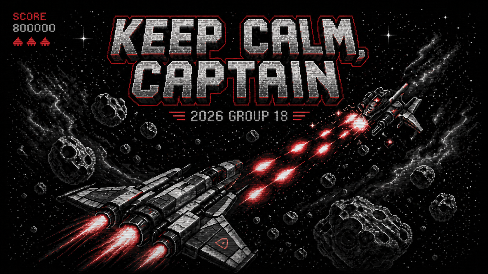
     
  </a>

A browser-based Asteroids-style arcade shooter built in p5.js - **Keep calm, captain!** ([Play it here](https://uob-comsm0166.github.io/2026-group-18/)), centred on a **Stress mechanic** that changes how the ship handles during play. Instead of treating damage as a simple health reduction, our game turns collisions into a controllability problem: taking hits raises the player’s Stress meter, and higher stress degrades ship handling in fixed, predictable tiers. This transforms the core loop from simple survival into risk management: play aggressively to score more, or play safely to preserve precision and control

## Video Demonstration

  <a href="https://youtu.be/X5tYzrVyDQQ">
    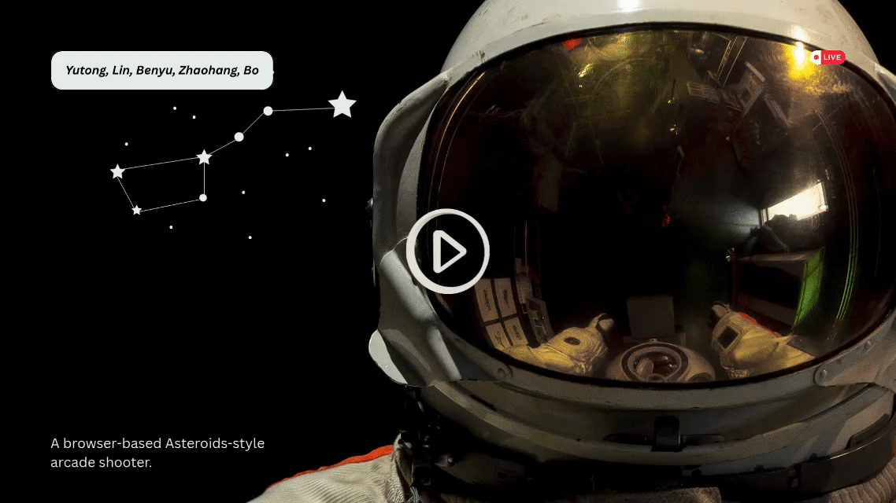
  </a> 
  <i>This video provides a clear walkthrough of our complete project workflow.</i>

## Contents
1. [Our Group](#our-group)
2. [Introduction](#introduction)
3. [Requirements](#requirements)
4. [Design](#design)
5. [Implementation](#implementation)
6. [Evaluation](#evaluation)
7. [Process](#process)
8. [Sustainability, Technical, Social and Accessibility](#sustainability-technical-social-and-accessibility)
9. [Conclusion](#conclusion)
10. [Contribution Statement](#contribution-statement)
11. [AI Statement](#ai-statement)
12. [Reference](#reference)
13. [Additional Marks](#additional-marks)

## Our Group

  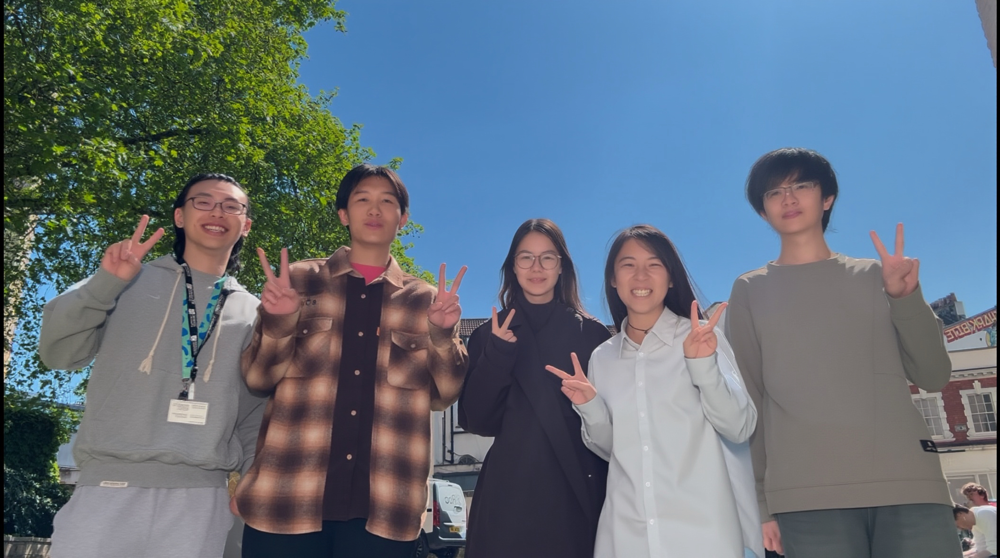 
  <i>Come and meet our astronauts!</i>

| Group member | Email | GitHub Username | Primary Responsibilities              |
|---|---|---|---------------------------------------|
|Lin Zhu|zhulinuk2025@gmail.com|kath0925| Project management, Game loop         |
|Benyu Zhu|benyuzhu@outlook.com|Josh-Zhu0326| Testing and evaluation                |
|Yutong Liu|yutong11x@outlook.com|Volta0411| Implement, UI，Presentation            |
|Zhaohang He|zhaohanghe89@gmail.com|Zhaohang89| Gameplay implementation and debugging |
|Bo Sun|bowillrich@gmail.com|bowillrich-cell| Architecture and implementation       |

## Introduction

We made this Asteroids-style shooter([look game demo here](https://youtu.be/KouKVKXn1Ak)) in p5.js. The basic idea is pretty familiar - you fly a spaceship around, dodge stuff, shoot things, and try to survive while getting the highest score possible. But we wanted to do something a bit different with the core mechanic.

The main twist is what we call the **Stress system**. Every time you crash into something or get hit, your stress goes up. And here's the thing - when you're stressed, your ship just doesn't handle as well. We're talking slower turning, clunkier thrust, that kind of thing. It's split into clear tiers so you always know what you're dealing with. There's also these pickup items that help you calm down a bit.

This creates this interesting balance where you have to think about whether it's worth playing aggressively to rack up points, or playing it safe to keep your ship feeling nice and responsive. The difficulty doesn't just come from enemies getting faster or more obstacles appearing — it comes from how well you're doing. Mess up too much and the game literally feels harder to play.

We also made sure the stress thresholds are fixed and the UI shows your stress level clearly, so it stays fair and readable. On the technical side, building the stress state machine and tuning how the ship moves at different stress levels was actually pretty challenging and gave us a solid focus for the development side of things.

## Requirements

According to Ludewig(2003)'s idea, software artefacts should be understood as models rather than reality itself. We treated requirements as revisable models of player needs: they describe the game through player-observable behaviour, make scope decisions explicit, and remain open to refinement when evaluation evidence reveals mismatch with actual play experience. Therefore, we framed the game around the player’s struggle to survive under pressure: a space arcade shooter in which the player attempts to achieve the highest possible score while managing increasing stress.

### Early Ideation

During the ideation stage, we collected inspirations based on the types they are interested in respectively, and compared multiple directions through the [inspiration list](materials/requirements/inspiration.md).

We did not merely compare "which game is more interesting", but focused on evaluating four dimensions: gameplay novelty, feasibility of p5.js implementation, controllability of the MVP range, and whether it can form a clear engineering challenge. This comparison process(Figure 1) helps us avoid choosing solutions with excessive content or those that are difficult to evaluate from the very beginning.

  <b>Figure 1: Candidate Idea Comparison</b> 
  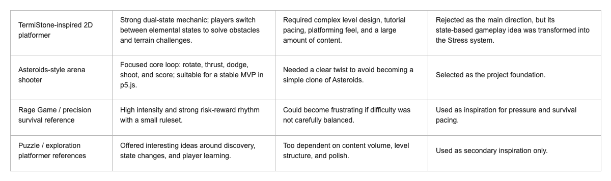 
  <i>Candidate idea comparison used during early ideation.</i>

### Feasibility Studies

One early game idea was inspired by TermiStone - a 2D platform game, whose core mechanic is a dual-state system. The player need to switch different elemental states and use state-specific abilities to overcome difficult in it. This idea was highly appealing and every team member who tried it would immediately say: “it should be our project!” We had even produced an [inspiration video](https://www.youtube.com/watch?v=za6nsWXRI2Y) to explore the inspiration further.

However, after considering the project requirements, we argued that this idea would be too difficult to achieve within the available time. Such a platformer game would heavily rely on complex level design, careful paced tutorials, precise movement feel, and amount of content, which introduced a high risk of scope expansion. 

Therefore we changed the project foundation toward an [Asteroids-style arena shooter](materials/requirements/final-idea.md) instead, because whose core loop was more realistic for a p5.js project: rotating, thrusting, dodging, shooting, and scoring. At the same time, we preserved the original idea of state-influenced gameplay - reworked it into **Stress system**. This twist turns the game from simple survival into risk management..

### Stakeholder and Top-level Need

The stakeholder onion model suggests that stakeholders should be identified around the product or service itself rather than only around the development team (Alexander and Beus-Dukic, 2009). Based on this theory, we used stakeholder analysis to connect requirements to the context of the game and identified four main stakeholder groups later: 

- **Players** are the primary users. They interact directly with the game and benefit from an enjoyable, fair, and understandable play experience. Their main needs are intuitive controIs, clear HUD feedback, fair difficulty, and smooth gameplay. 
- **Game Developers** are close to the product during development, so their care about modular structure, maintainability, extensibility, and testability. 
- **Course Instructors** act as surrogate and assessment stakeholders. Their responsibility is to judge whether the project has clear requirements, justified decisions, traceable evidence. 
- **Playtesters** provide feedback by finding usability issues, balancing problems, and gameplay defects that the team might miss ourselves. 

From these stakeholders, we derived several top-level needs table which is summarized below.

  <b>Table 1: Top-level Needs Based on Stakeholders</b> 
  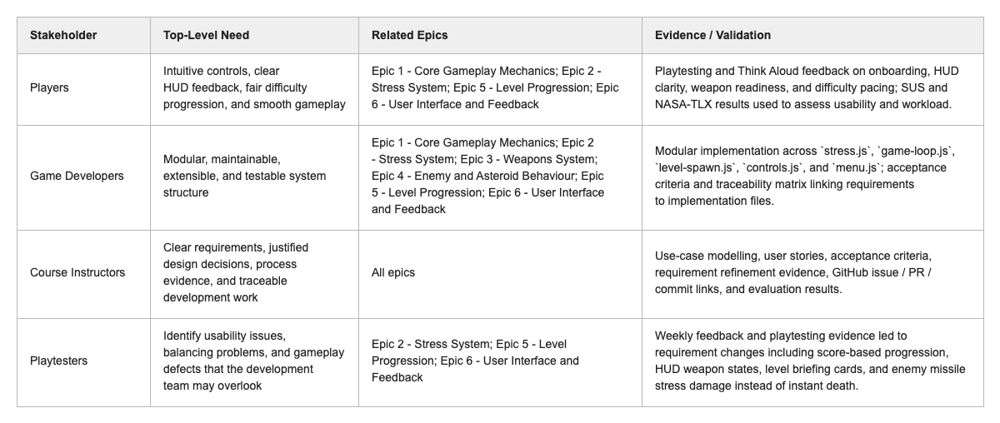 
  <i>Top-level needs derived from the project stakeholder analysis.</i>

### Epics and User Stories

Around these needs, we organized the project into 6 epics, as shown in Figure 2, and then defined user stories under each epics.

  <b>Figure 2: Six Implementable Epics</b> 
  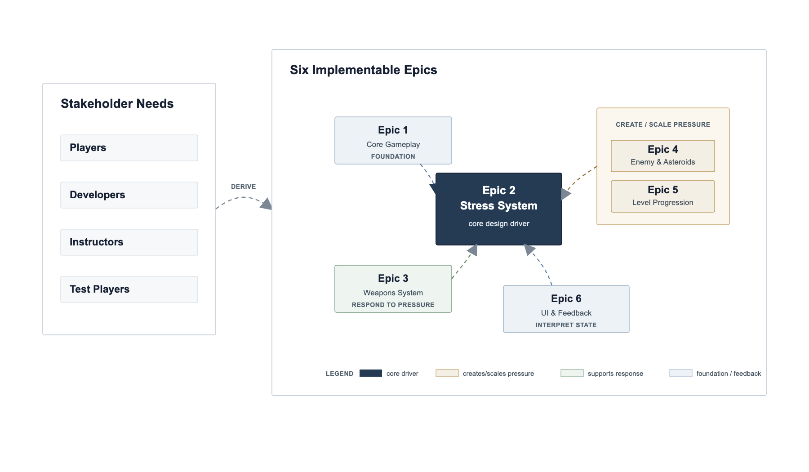 
  <i>Six implementable epics showing how requirements were organised.</i>

The user stories were structured based on the player value. Some stories focus on ship control, collision consistency, and HUD readability, which made new players better understand the whole game and feel fair. Other stories define the core twist - stress system, which includes stress gain, stress recovery, and tier-based handling changes. We also defined stories for weapon cooldowns, enemy pressure, and level progression, which increased depth and motivation for experienced players. Overall, this means that **stress system** is a central design driver across the requirements layer.

### Use Case Modelling

Our team then use **Use-case modelling** to describe system behaviour from the perspective of players' interactions. The final model contains only one actor: **Player**. It keeps the system boundary focused on the single-player gameplay loop.

  <b>Figure 3: The Use-case Diagram</b> 
  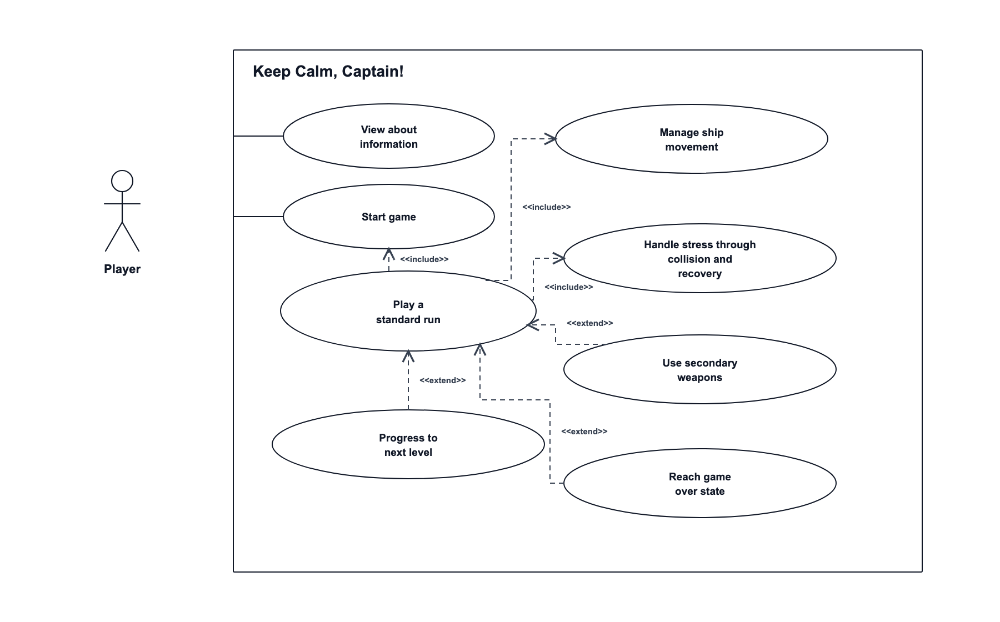 
  <i>Use-case diagram describing the player's main interactions with the game system.</i>

The reason why the use-case diagram only retains players as actors is that the goal of this diagram is to describe runtime system interactions between the player and the game system.

### Use-Case Specification Tables

There are two core use-case specification tables: The first is **Start and Play a Standard Run**, which covers the full player journey from the main menu and level briefing, into active gameplay, then through movement, weapons, etc. and finally into the game-over state.

  <b>Table 2: Use Case A - Start and Play a Standard Run</b> 
  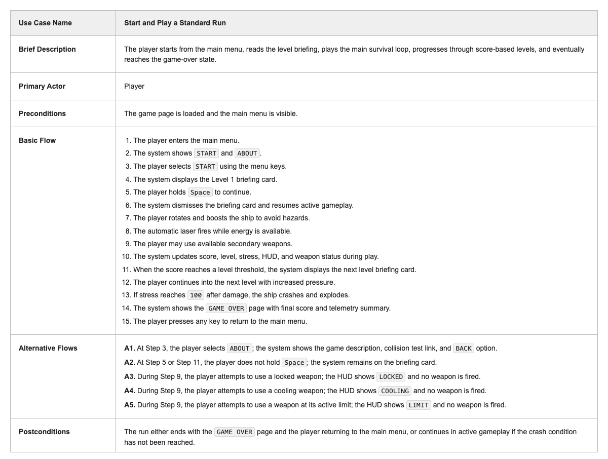 
  <i>Use-case specification for starting and completing a standard game run.</i>

The second is **Handle Stress through Collision and Recovery**. This focuses on the core gameplay mechanic: collisions and hits increase stress, stress changes the HUD and ship handling, recovery pickups reduce stress, and passive decay helps the player regain control when they avoid further damage.

  <b>Table 3: Use Case B - Handle Stress through Collision and Recovery</b> 
  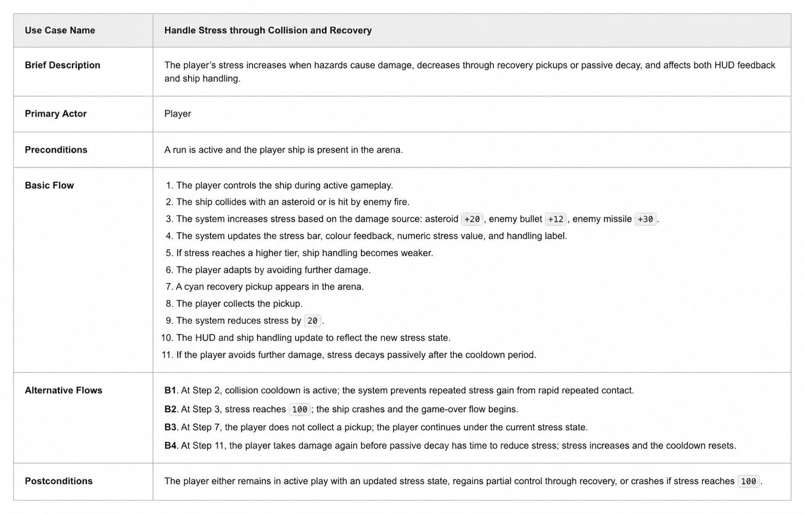 
  <i>Use-case specification for stress gain, recovery, and handling changes.</i>

These use-case specifications informed the later sequence diagrams in the design section, especially the collision-to-stress path and the pickup-to-recovery path - both paths require coordinated behaviour across gameplay, HUD, and state-management subsystems.

### Acceptance Criteria and Iterative Refinement

If the story is merely staying at the level of "user stories", all of the project would become uncheckable. That is the reason we further refined the requirements into "verifiable and testable rules" - [acceptance criteria](materials/requirements/acceptance-criteria.md) in a Given / When / Then format. For example:

  <b>Figure 4: Acceptance Criteria Examples</b> 
  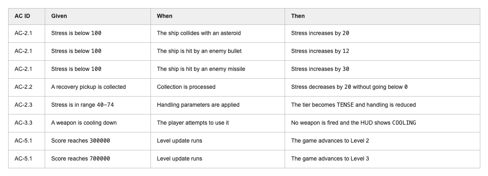 
  <i>Examples of acceptance criteria written in a verifiable format.</i>

In this way, the most important behaviours of the project could be written as verifiable conditions. The requirements are modified through feedback from playtesting, Think Aloud sessions, [weekly feedback](materials/evaluation/weekly-feedback/2026-03-10-weekly-feedback-and-goals.md), etc. Table 4 below summarised the most important requirement changes.

  <b>Table 4: Requirement Refinement Evidence</b> 
  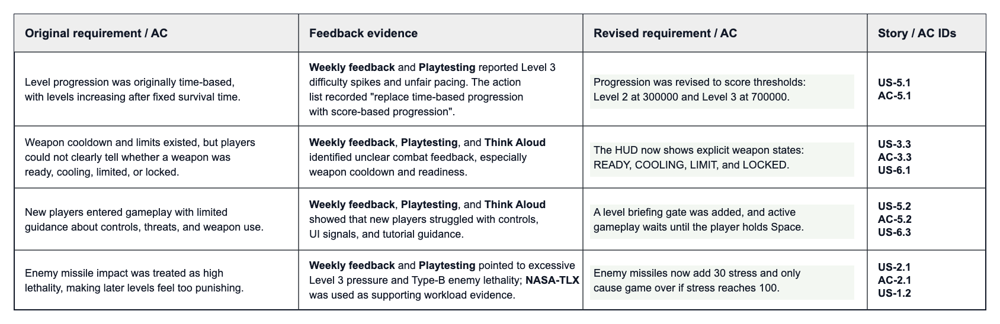 
  <i>Evidence showing how requirements were refined through feedback and testing.</i>

According to these evidence, we made several key adjustments:

- We changed progression from **time-based progression** to **score-based progression**;
- We made `READY`, `COOLING`, `LIMIT`, and `LOCKED` states explicit in the HUD, and improved onboarding through **level briefing cards**;
- We changed enemy missiles so that they **increase stress** instead of **causing instant death**.

These changes show that the requirements artefacts in this project were not static records, but guided development and supported ongoing design refinement.

## Design

### Design Goals and Architectural Approach

At the beginning of the programme, we ensured to put our core gameplay of this game as the **pressure system**, and we made lots of predictions about the situation that might happening during the process. For example: the numerical design, gameplay operation, the speed of feedback and so on. In the end, we confirmed that use a **hybrid OO-design** approach to design the game, which means divided the system into two layers: **classifying entity objects** by classes and implementing **operation control** by functions. This separation aligns with the use of UML class diagrams for structural modelling and sequence diagrams for behaviour (Fowler, 2004). And we have roughly divided the classes by drawing software: UMLetino. Now we have the diagram completely.

### System Architecture

The part of the entity class, which is including all the objects that player can see during the game, such as the player-controlled aircraft, randomly generated enemies and items that can be picked up. These entities only need to hold their own position, state, speed and behavior. We let them manage themselves through **encapsulation**. The frame-by-frame scheduling, enemy generation judgment, collision resolution and interface update are coordinated by the functions of the control layer. In this structure, because most of the entities in the game are independent objects, the complexity of a single class is reduced a lot, and different subsystems can work more clearly during the game. This structure also makes the codebase easier to maintain. For example, the spawn and split logic is needed, and the game’s core pressure system is only responsible for converting the player’s collection events into a change in pressure and triggering certain mechanics when the pressure reaches a threshold. It allows new entity types or gameplay method to be added without significantly modifying existing components. We use a clearly defined interface to connect the entity object layer and the function implementation layer. The function control layer updates and plans the entity each frame, and the entity object layer provides the local state and behavior for the function control layer to process.
The following picture shows all the **classes** in our game.

### Class Design

In terms of more detailed class design, the Asteroid class represents objects with multi-stage destruction behavior, and the enemy is a local unit with different types and active shooting skills. The Pickup class is used to implement the recovery mechanism. Player related objects are responsible for moving, colliding and updating the state of the pressure value. Projectile classes are divided into laser, missile, mine and enemy missile. These skills also have their own behavior mode; each weapon class is responsible only for its own attack behavior. In the main file, these functions are used only as references and are not involved in the internal implementation. 

The following picture shows the main functions in our game.

  <b>Figure 5: All the Classes</b> 
  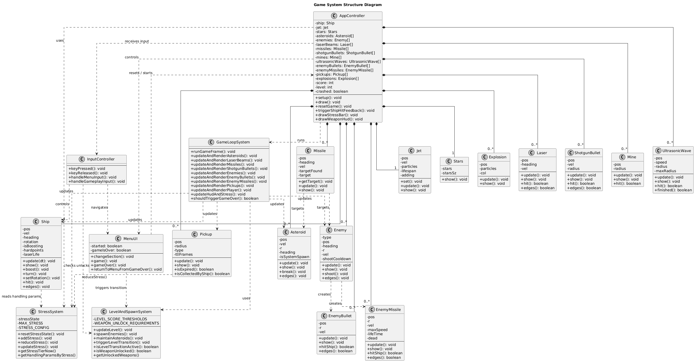 
  <i>Class diagram showing the main object structure of the game.</i>

### Behaviour

In the behavior design, the system is organized around the **main loop**, which performs update, collision detection, feedback processing and state judgment in turn during each frame. For example, when the player accidentally touches a meteorite, the system will directly affect the feel of player’s control, the meteorite split and other effects; When the player is hit by a meteorite or an enemy bullet, the system will increase the pressure value and determine whether the threshold has been reached. As the pressure gradually increases, the player needs to continue to play under high pressure (feedback is the operator's feel). We consider this design to be a core form of feedback for the game. The stress system, as our core system, acts as a **bridge** connecting different subsystems. Damage events increase stress, and items are picked up to decrease stress, which is then linked to operational parameters through thresholds to create a dynamic difficulty system based on the player's performance, so that the player is faced with a different game each time.

  <b>Figure 6: Functions in the Game</b> 
  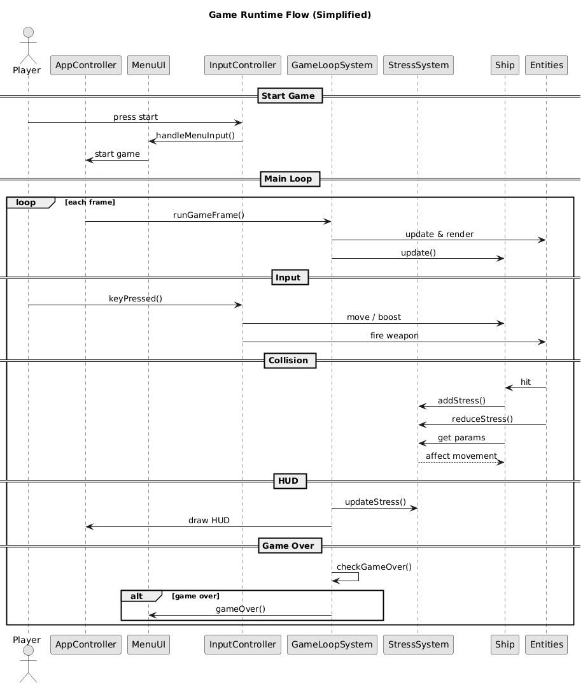 
  <i>Function-level diagram showing how gameplay logic is coordinated.</i>

## Implementation

During the implementation, we have designed 3 challenges:

1. Creating the stress system instead of instant death;
2. Replacing time-based level upgrade system by score-based;
3. Adding new weapons and enemies to increase diversity;

### Challenge 1: Creating the stress system instead of instant death

In the earliest version of our game, the ship will collide with asteroid causing instant death. We considered this as over-frustrating punishment, and decided to change it. Instead, we designed a stress system. 

The stress system is constructed by three core species: the stress bar and current stress value, self recovery cooldown, and recovery item. Stress value is initially 0 and will only increase when crash with an asteroid. Once the value reaches 100, the ship will be destroyed. There are two ways to recover, either self recovery, or taking the recovery item. The self recovery cooldown will immediately start right after a collision or an attack. Self recovery will start at a constant rate if there is no extra contact between ship and enemies or asteroids. Similar to the recovery items, they will constantly appear without any influence. 

The other key design is on the handling performance degradation. As stress rise, the handling system of the ship will synchronous declines. In detail, turnings slows down, weaker thrusts, and more significant inertia. This is how our stress system punishing collision, by increasing difficulties in controlling and keep players under reasonable pressure. 

We also improved the game UI after testing. In the earlier version, the stress bar rose when the ship crashed, in which some of the tester feels unintuitive. We then redesigned it into a HP-like bar. In addition, we also changed the shape of our ship to give a clearer ship facing view, and adding colors to both ship and bar in order to tell players the stress conditions more directly. 

  <b>Figure 7: Annotated Game UI</b> 
  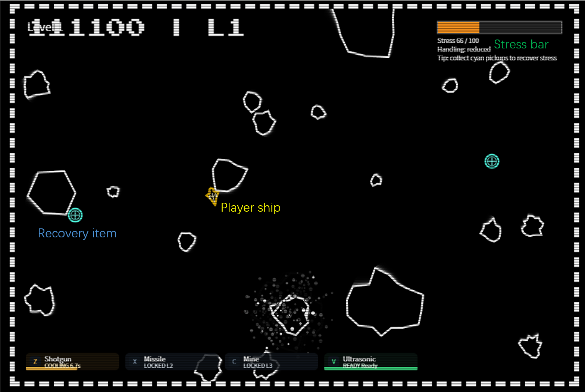 
  <i>Annotated interface showing the stress system and key gameplay feedback.</i>

### Challenge 2: Replacing time-based level upgrade system by score-based

The second challenge was to design an effective level progression system. We planed to create levels of difficulties so that we can guarantee everyone have their suitable experience, no matter they prefer challenging or relaxing, having good or poor skills on this type of game. We have inserted new weapons and enemies to make it more interesting. 

Our first version of the system was a time-based system: players can access to next stage when they have survived 90 seconds in the current stage. However during testing, most players declared that the system was dilatory and endless. The countdown display also cause complex problems: when it’s large, it blocked the view; when it’s small, it was easy to miss. These results implies that we need a better level upgrade system. 

Therefore we redesigned the system into a score-based version, destroying asteroids and enemies to earn scores. Compare to the time-based system, this version leading players to hit rather than dodge. In order to accomplish this, we set up a scoring model in which gain scores of asteroids according to their radius and scores of enemy ships are fixed values. This kept the system closely connected to the shooting game concept. 

After testing and discussing, we set the two level threshold: 30000 and 700000 points. It will automatically upgrade level when reaching them, and also unlock new contents. 

### Challenge 3: Adding new weapons and enemies to increase diversity

The third challenge was to expand the game content without affecting game balance. This makes our game more diverse and less boring, which in other way, attracting more players to try and stay. 

Generally we replaced the manual shooting by automatically shooting since some players reported that they kept pressing space which cause unnecessary work. We also added shotguns and ultrasonic in the first stage. The shotgun is designed to deal with multiples of asteroids coming from the ship’s front, while ultrasonic is to coop with wild range of small asteroids, so that players can destroy asteroids smaller than particular size. Since the ultrasonic is too powerful, we give it a rather longer cooldown to maintain balance. 

In the second stage, we provided a new missile weapon and new enemy blue ship. The blue ship injects missiles to our ship, which makes it more threatening. The homing missile is designed to counter these threats. However in the earlier version, the homing missile doesn’t have a target priority, which players complained a lot. We then wrote several if loops to test which target it was, and allow them to target the higher priority ships first. 

In the third stage, we introduced mines and yellow ship enemies. The yellow ships move towards our ship and fire homing missile as well. This is a more dangerous than the previous blue enemy, and the mines are their counters. However, it seems that the yellow ships can shoot the missile to us before it steps on a mine, hence we have to lower the damage per missile to make it less punishing.  

| Weapon | Preview | Description |
|---|---|---|
| Shotgun |  | Fires seven pellets in a forward cone, making it effective against clusters of asteroids. |
| Ultrasonic |  | Releases an ultrasonic wave around the ship, destroying nearby asteroids that are not newly spawned. |
| Homing Missile |  | Launches a tracking projectile that prioritises high-threat enemies. |
| Mine |  | Remains in place and detonates when a high-threat enemy comes into contact with it. |

## Evaluation

### Qualitative Evaluation: Think Aloud

In the qualitative evaluation, since the original game has a relatively simple gameplay and a reliable code, we focused on all possible problems of our changes on the challenges. In other words, can players understand game rules and controls, would they correctly understand the stress system, whether they could judge the right timing to use skills, and will they accept the increase in difficulties in level upgrade system.
As part of this evaluation, we invited players to try the game directly and observed their reactions while they played.

  <b>Figure 8: Player Playtesting Sessions</b> 

<table align="center">
  <tr>
    <td>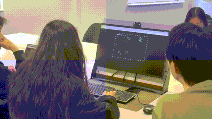</td>
    <td>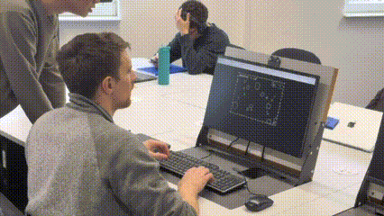</td>
    <td>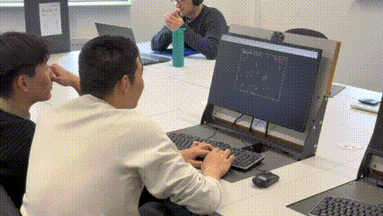</td>
  </tr>
  <tr>
    <td>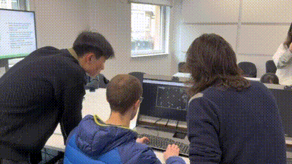</td>
    <td>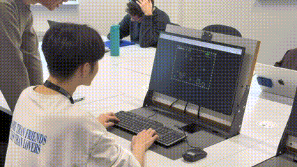</td>
    <td>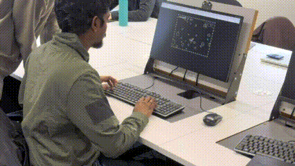</td>
  </tr>
</table>

  <i>Playtesting sessions used to collect feedback on gameplay, controls, UI clarity, and the stress mechanic.</i>

The results tells us there are several problems. The main one is the onboarding and controls. Some players cannot understand how to control our ship without additional guidance. Some even reported that the game was a fixed position shooter rather than dodging asteroids. This implies that, in the earlier version, our game didn’t have a clear tutorial on controls, which we had improved in the latest version. In addition, some testers told us that the ship’s facing direction is unclear during the fast paced game.

The second major issue was the understandability of our stress system. Our original design was an increasing stress bar, which was unintuitive to some of the testers. Also, the results of increasing stress, as in the handling performance degrading, were not clearly pointed out. There was a similar problem in the third challenge on weapons and enemies, which was the cooldown indicator. Hence this problem can be analyzed as: For the new mechanism we have introduced, we need clearer indicators to let players know what has changed.

Overall, the qualitative evaluation has shown that the main problems were not the mechanisms themselves, but on the onboarding, feedback visibility, and system understandabilities. Based on these results, we need to improve, especially for new players, readabilities and gaming experiences. 

### Quantitative Evaluation: SUS and NASA-TLX

  <b>Table 5: SUS Final Scores</b> 
    <table>
      <thead>
        <tr>
          <th>Participant</th>
          <th>Played Before</th>
          <th>Contribution Sum</th>
          <th>Final SUS Score</th>
        </tr>
      </thead>
      <tbody>
        <tr><td>P1</td><td>Y</td><td align="right">32</td><td align="right">80</td></tr>
        <tr><td>P2</td><td>Y</td><td align="right">30</td><td align="right">75</td></tr>
        <tr><td>P3</td><td>N</td><td align="right">30</td><td align="right">75</td></tr>
        <tr><td>P4</td><td>N</td><td align="right">27</td><td align="right">67.5</td></tr>
        <tr><td>P5</td><td>Y</td><td align="right">36</td><td align="right">90</td></tr>
        <tr><td>P6</td><td>Y</td><td align="right">36</td><td align="right">90</td></tr>
        <tr><td>P7</td><td>N</td><td align="right">22</td><td align="right">55</td></tr>
        <tr><td>P8</td><td>Y</td><td align="right">36</td><td align="right">90</td></tr>
        <tr><td>P9</td><td>N</td><td align="right">29</td><td align="right">72.5</td></tr>
        <tr><td>P10</td><td>Y</td><td align="right">30</td><td align="right">75</td></tr>
      </tbody>
    </table> 

  <b>Figure 9: SUS Score Comparison</b> 
  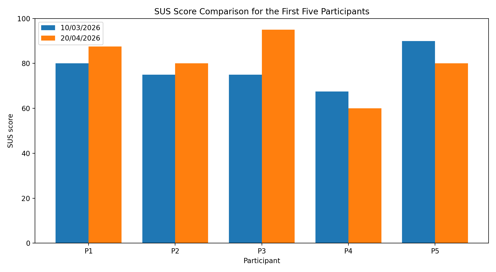 
  <i>SUS score comparison between experienced and inexperienced players.</i>

Here is also available as supporting evidence for the full usability evaluation results ([SUS Overall Chart](materials/evaluation/SUS-Overall.png)).

  <b>Table 6: NASA-TLX Average Scores</b> 
    <table>
      <thead>
        <tr>
          <th>Dimension</th>
          <th>10/3/2026</th>
          <th>20/4/2026</th>
        </tr>
      </thead>
      <tbody>
        <tr><td>Mental</td><td align="right">60.5</td><td align="right">34</td></tr>
        <tr><td>Physical</td><td align="right">22</td><td align="right">18</td></tr>
        <tr><td>Temporal</td><td align="right">67.5</td><td align="right">43</td></tr>
        <tr><td>Performance</td><td align="right">56</td><td align="right">42</td></tr>
        <tr><td>Effort</td><td align="right">45</td><td align="right">51</td></tr>
        <tr><td>Frustration</td><td align="right">28</td><td align="right">14</td></tr>
      </tbody>
    </table> 

  <b>Figure 10: NASA-TLX Dimension Comparison</b> 
  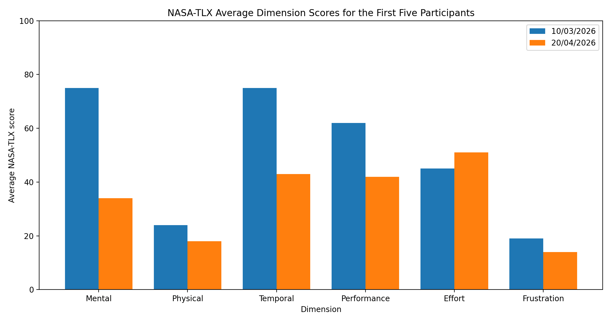 
  <i>Comparison of NASA-TLX dimensions across the two evaluation rounds.</i>

Here ([NASA-TLX Chart](materials/evaluation/nasa-tlx-chart.png)) is supporting evidence for the full workload evaluation results.

We had also done two quantitative evaluation to verify our thoughts. 

For the System Usability Scale (SUS), we had measured the overall perceptions of is to use liability, and confidence. Which our game achieved an average score of 77, a generally positive result of assessment. 

We had also compared those players who had similar game experience before, and who has no such experience. We got an average score of 83.3 for those players who had experience of similar games but only 67.5 given by those players who had no experience which enhance our conjecture. We had already made this game intuitive enough for those experienced players. We now need to improve the playing experience for the others. 

Looking at the individual questions there are some lower scores mainly related to the willingness to continue use our system, players comfort during operation, and players level of confidence on using the system. We are confident to say that our system is relatively good for the experience players, but it was not sufficiently beginner friendly. This appears in many aspects. For example, two participants gave low scores for Q1 and Q8, performing that the ships inertia made the controls, feeling  uncomfortable. These results reminded us that player needs more clear, guidance feedback, and the difficulty adjustment in order to adapt this game more quickly.

We also used NASA-TLX as part of our quantitative evaluation. Lower physical demand and higher mental demand is more likely to be caused by our stress driven handling performance degrading. This allowed us to test how the pressure affected by our gameplay and workload. The results of the temporal demand was the highest-rated dimension, which proved that we need to lower the pressure and tension. 

In order to compare how our changes performed in the new game version, we did another quantitative evaluation and produced new charts. There is a clear decrease in both mental and temporal demand which means we achieved part of our goals, players do experience lower pressure and tension in the later test. However, we tied to use same participants’ results in the two tests to do Wilcoxon Signed Rank Test, we didn’t get a significant difference from the current data size. For NASA-TLX, we only get p = 0.188. We tried to used different data source to do Mann-Whitney U Test but this didn’t work as well. 

### Code Testing

In our final evaluation part, we need to test our code itself. We adopted a black-box test approach, according to our challenges, splitting our inputs into valid and invalid, then compare the expect and actual output. 

#### Code Testing: Stress System and Feedback

| Partition | Expected Output |
|:---:|:---:|
| Valid collision: ship collides with an asteroid | Stress value increases correctly and HUD updates |
| Valid hit: player is hit by an enemy projectile | None |
| Valid recovery: player picks up a recovery item | Stress value decreases correctly |
| Invalid recovery: no recovery item picked up | None |
| Valid self recovery cooldown finish | Stress starts to recover naturally |
| Invalid self recovery cooldown not finished | None |
| Valid tier change | Handling and colour feedback update correctly |
| Valid upper limit reached | the game ends |

#### Code Testing: Scoring and Level Progression

| Partition | Expected Output |
|:---:|:---:|
| Valid asteroid destroyed | Score increases correctly according to radius × 100 |
| Valid enemy destroyed | Score increases correctly according to fixed value |
| Invalid scoring: no target destroyed | None |
| Valid progression condition: score ≥ 300000 | Enter Level 2 |
| Valid progression condition: score ≥ 700000 | Enter Level 3 |
| Invalid progression condition: score below threshold | None |

#### Code Testing: Weapon Activation, Cooldown, and Enemy Behaviour

| Partition | Expected Output |
|:---:|:---:|
| Valid weapon activation | Weapon is successfully triggered |
| Invalid weapon activation: cooldown not finished | None |
| Invalid weapon activation: not unlocked | None |
| Valid homing missile locks onto enemy | Prioritises high-threat enemies |
| Valid homing missile locks onto asteroid | Locks onto a valid asteroid target |
| Valid mine placement | Mine is placed successfully |
| Invalid mine placement: maximum reached | None |
| Valid blue ship spawn | Spawns correctly in Stage 2 and above |
| Invalid blue ship spawn | Does not spawn before Stage 2 |
| Valid yellow ship spawn | Spawns correctly in Stage 3 |
| Invalid yellow ship spawn | Does not spawn before Stage 3 |

## Process

In our project, the team consists of five people to jointly develop a classic game based on the browser Asteroide. During the whole game development process, we adopted a combination of modular division of labour and collaborative development to ensure the complete development of the whole game and the quality assurance of the code. The team has the close coorperation.

In order to improve the efficiency of group collaboration, the five of us divided the whole game system into multiple core modules, including: Game Loop, Collision System, Entities, UI/Menu and Controls. It can ensure that each of the five people is responsible for a core module and participates in the overall testing and optimisation in the later assembly stage, so as to achieve the balance and integrity of task allocation.

  <b>Figure 11: Team Communication via WeChat</b> 
   
  <i>Team communication record showing coordination through WeChat.</i>

In terms of communication, we held many seminars at the beginning of this project. The direction of the discussion was mainly aimed at the selected game, the improvement of the difficulty of the game, and the innovation and transformation of the game. The first meeting of five people in our group was held online. The meeting lasted for more than an hour. The content of the meeting focused on the repair of game bugs, the level design of the follow-up game, and the core module content that everyone was responsible for .

  <b>Figure 12: Team Members Collaboratively Testing the Game</b> 
   
  <i>Team members testing and discussing the game together.</i>

During the development process, we have selected a series of tools to support our development and collaboration:

  <b>Figure 13: The Record of Pull Requests</b> 
  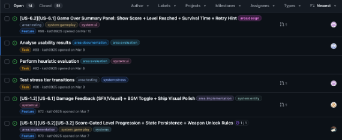 
  <i>Pull request record showing the team's GitHub collaboration workflow.</i>

Our team adopted a structured project management approach, integrating Kanban, GitHub workflows, and progress tracking tools to support efficient collaboration throughout the project. 

We use a kanban-based system to organize tasks and monitor progress. Tasks are clearly divided into stages such as backlog, to-do, in progress, testing, and completed, allowing all team members to have a clear understanding of the project status. Responsibilities are clearly defined, and tasks are assigned weekly to ensure a balanced workload for each member and clear deadlines.

  <b>Figure 14: Kanban Board for Project Management</b> 
   
  <i>Kanban board used to organise tasks and monitor project progress.</i>

We mainly realise team development and collaboration on GitHub, and the traces of our collaboration and development can be clearly seen on branches, commits, and pull requests. Each of our members develops functions on an independent branch and uses pull request to review the code. The process of each pr requires at least two members to review and pass, and then the next code writing can be carried out.

### The Usage of Different Tools

| Tool Name | Purpose | Usage |
|-----------|---------|-------|
| GitHub | Version control and code collaboration | Used branches and pull requests to manage and integrate code |
| P5.js | Game development framework | Used to implement game rendering, animations and interactions |
| Visual Studio Code | Development environment | Used for writing and debugging JavaScript code |
| Kanban Board | Task management | Used to track task progress and allocate responsibilities |
| Browser Developer Tools | Debugging tool | Used to identify runtime errors and performance issues |

To realise this project, we have made a reasonable distribution of tasks, so that each member can share the similar difficulty and complexity.

Work allocation to ensure everybody pays an effort to the project, so that every one can have a contribution.

###  Content Introduction

In the middle and late stages of the project, due to time schedule and geographical restrictions, we gradually turned to online collaboration and held Scrum-like meetings through Microsoft Teams and WeChat voice calls, about twice a week. This short-term and frequent meeting mode has significantly improved the efficiency of communication. Unlike the relatively free and long offline discussions in the early days, these online meetings are more structured and usually revolve around "current progress, problems and next task allocation", so that the team can promote the development progress more clearly.

  <b>Figure 15: Burndown / Progress Chart of the Project</b> 
   
  <i>Burndown chart showing the team's progress over the project timeline.</i>

During the project development process, we tracked the overall progress through the burnout diagram. It can be seen from the figure that the team's work progress is uneven in time, especially in the mid-term stage, where there is obvious centralised completion of tasks, which shows that members tend to carry out "sudden development" when the deadline is approaching.

  <b>Figure 16: Commit and Branch History Visualization</b> 
  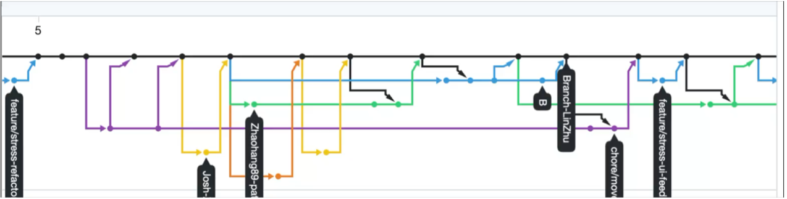 
  <i>Commit and branch history visualisation showing the development workflow.</i>

Although this method ensures the completion of stage goals to a certain extent, it also brings greater time pressure. 

However, in the final stage of the project, we successfully completed all the planned tasks and overcame various challenges, including several technical difficulties encountered during the development process.

## Sustainability, Technical, Social and Accessibility

### Sustainability

In our project, we want to develop a game that focusses on user interaction and participation. According to Becker et al. (2015), design decision-making will affect the long-term impact of the system. Based on this, this game aims to have a simple but positive impact on user behaviour.

This game is not only for entertainment but also takes into account its broader impact on users. The Karls Kruner Declaration emphasises that sustainability includes not only environmental aspects, but also social and personal aspects. Therefore, this game aims to provide a meaningful experience while keeping these aspects in mind.

Most of the games are developed using p5.js, do not rely on large-scale data graphics processing and large-scale server support, and reduce carbon emissions to a certain extent, combining the basic concept of green software development.

### Technical

From a technical point of view, the design of this game has clear functionality and concise structure. Duboc et al. (2019) pointed out that we should have a clear understanding of what we have built and how our design decisions affect the whole system. Based on this, this game focusses on maintaining the understandability and purposefulness of the design.

The game will also consider efficiency and resource utilisation during the implementation process. The green software model emphasises the importance of reducing unnecessary calculations and making the system more efficient. Therefore, the game is designed to be simple to operate and avoid unnecessary complexity. 

When we designed the game and arranged the tasks, we divided the game into multiple independent parts completed by one person, fixed the bugs of the game, and better developed the design of the game. While developing, it also ensures the stability of the game when multiplayer is online. We use standard development tools and game development processes (such as GitHub and version control mechanisms) to ensure the consistency and traceability of the code. It is not only conducive to teamwork but also improves the quality of the code.

### Social

From a social perspective, this game aims to provide users with a simple and fascinating experience. Sommerville (2020) pointed out that software systems should consider their impact on people and the interaction between them. Based on this, this game focusses on ease of use and accessibility.

As an entertainment application, the purpose of the game itself is to provide users with relaxation and pastime entertainment, which can relieve stress to a certain extent. The most important thing is that the design of our game is intuitive, and players can get started quickly, which greatly improves the playability of the game.

### Accessibility and Ethics

In another sides, the game follows basic principles of responsible software use. It does not collect or misuse user data, and it avoids any violent or inappropriate content, meeting Fundamental ethical standards. The Green Software Practitioner highlights that software should minimise harm and respect users. In this context, the game provides a safe and appropriate environment for its audience.  

This game mainly relies on keyboard operation, and the operation method is relatively simple, which is favourable to most users. However, the movement mode we mainly use is concentrated in the right hand, and the left hand is used to release skills, which is a little unfriendly for players who are used to left-handed control. We will upgrade the game in the future to improve accessibility.

## Conclusion

Finishing this project felt pretty good. The five of us started from scratch and built an Asteroids-style space shooter with a twist — the **Stress system**. Getting hit doesn't just damage you, it messes with your ship's handling. Players have to choose between playing aggressive to score higher or playing safe to keep controls tight. That's the core fun.

It wasn't all smooth sailing though. Playtesting revealed problems: new players didn't know what to do, UI feedback was confusing, and later levels got way too hard too fast. We fixed what we could through repeated user testing and weekly iterations.

Working as a team had its challenges — merging code was messy at first until we sorted out naming conventions and code reviews. We used GitHub Projects for task tracking and weekly meetings to set priorities. The biggest lesson? **Plans don't survive contact with reality.** We had to cut features we wanted, but prioritising MVP from the start made those calls easier.

Looking back, we learned how to turn a vague idea into something playable, how to use feedback to drive improvements, how to coordinate in a small team, and how to work with AI tools without relying on them too much.

This project wasn't perfect, but it's something we genuinely built together. Thanks for checking it out!

## Contribution Statement

The following table summarises the responsibilities and contributions of each team member:

| **Member** | **Main Responsibility** | **Key Contributions** | **Contribution Rate** |
|---|---|---|------------:|
| Lin | Project Management and Game Loop | Project planning, task coordination, game state management, update flow, and runtime stability |         20% |
| Benyu | Testing and Evaluation | Test planning, evaluation design, SUS/NASA-TLX analysis, and report evidence organisation |         20% |
| Yutong | Implementation, UI, and Presentation | UI/menu implementation, screen transitions, presentation preparation, and game-state display |         20% |
| Zhaohang | Gameplay Implementation and Debugging | Gameplay feature implementation, entity behaviour, debugging, and runtime issue fixing |         20% |
| Bo | Architecture and Implementation | Architecture design, implementation support, interaction handling, and code structure refinement |         20% |

All members also contributed to group discussions, iterative decision-making, and the overall refinement of the project deliverables.

## AI Statement

We used chatGPT and codex in this project, and learned how to code and maintain the project with AI tools. I spend one day to learn how to code with codex in vscode, and share this with my teammates.

We used Codex to refactor parts of the codebase, making it more readable and making the structure easier for our team to understand and maintain. we also prepared a markdown file containing natural language prompts, which helped us generate supporting documentation, including a file explaining the overall project structure and the relationships between classes. We ask codex to run this file every time before push to GitHub, and this improved the communication efficiency of our team.

Next, Codex was used to produce the initial versions of some weapons and enemies. These early examples were not treated as final solutions, but as learning scaffolds: they gave us a starting point for understanding how these systems could be built in p5.js, after which we designed and implemented additional weapons and enemies ourselves.I wrote the ultrasonic wave weapon after reading the weapons wrote by Codex, and re-wrote the AI logic of the missile under the guidance of GPT.

AI image generation was also used to create a new spaceship asset for the game. In addition, ChatGPT was used throughout the project to explain code behaviour, clarify project-level design questions, and help us understand technical issues when we got stuck. It was especially useful when working with an older version of p5.js, where GPT helped us quickly identify the correct functions and older API usage that matched our version. For example, when I was writing the ultrasonic wave weapon, I need to draw a circle with p5.js, but the version of p5.js of the origin game was too old that the function on the web didn't work, GPT helped to find the correct circle draw function version.

We also explored whether an embedded large language model could be used inside the project. In this experiment, I tested running a model through WebGPU in the browser and confirmed that this approach was technically possible. However, we decided not to continue with it because loading the online Qwen 0.5B model was too slow for practical use in our game context. As a result, this idea was investigated but not included in the final version of the project.

Overall, we learned to how to use AI in our project, and it's a valuable knowledge. In the mean time, we still write and read the code ourselves to help us understand what a project should be like.

## Reference

Alexander, I. and Beus-Dukic, L. (2009) Discovering Requirements: How to Specify Products and Services. Chichester: Wiley.

Becker, C., Betz, S., Chitchyan, R., Duboc, L., Easterbrook, S. M., Penzenstadler, B., Seyff, N. and Venters, C. C. (2015). Requirements: The key to sustainability. IEEE Software, 33(1), pp.56–65. Sustainability Design and Software: The Karlskrona Manifesto

Becker, C., Betz, S., Chitchyan, R., Duboc, L., Easterbrook, S. M., Penzenstadler, B., Seyff, N. and Venters, C. C. (2015). Sustainability Design and Software: The Karlskrona Manifesto. Available at: https://www.karlskrona-manifesto.org (Accessed: 21 April 2026). Requirements: The key to sustainability

Duboc, L., Penzenstadler, B. and Porras, J. (2019). Do we really know what we are building? In: Proceedings of the IEEE 27th International Requirements Engineering Conference. IEEE. Do we really know what we are building?

Green Software Foundation (2023). Green Software Patterns. Available at: https://patterns.greensoftware.foundation/guide/suggested-tags (Accessed: 21 April 2026). Green Software Patterns (see the Catalogue part).

Green Software Foundation (2023). Green Software Practitioner. Available at: https://learn.greensoftware.foundation (Accessed: 21 April 2026). Engineering software products

Ludewig, J. (2003) ‘Models in software engineering – an introduction’, Software and Systems Modeling, 2, pp. 5–14. doi:10.1007/s10270-003-0020-3.

Sommerville, I. (2020). Engineering Software Products. London: Pearson. Green Software Practitioner, from Green Software Foundation.
