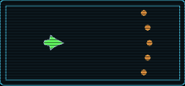
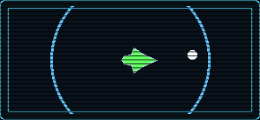
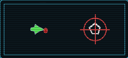
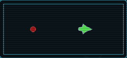
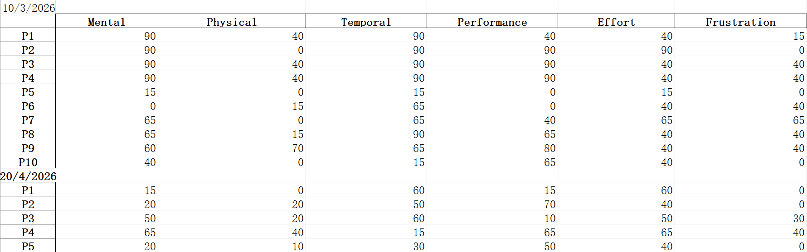
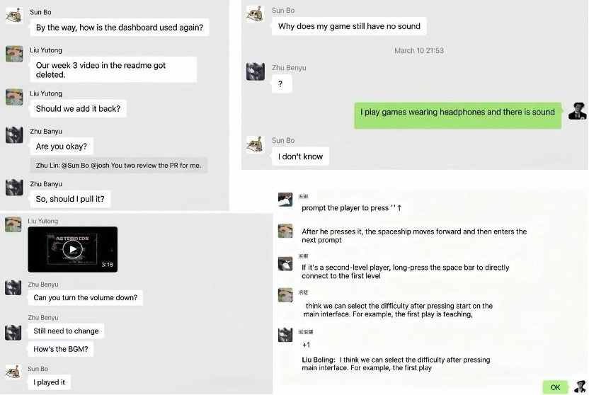
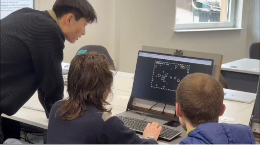
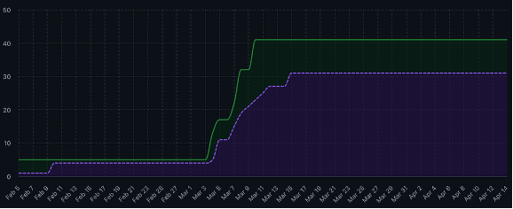

# Keep Calm, Captain!

  
     
  </a>

A browser-based Asteroids-style arcade shooter built in p5.js, centred on a Stress mechanic that changes how the ship handles during play. Instead of treating damage as a simple health reduction, our game turns collisions into a controllability problem: taking hits raises the player’s Stress meter, and higher stress degrades ship handling in fixed, predictable tiers. This transforms the core loop from simple survival into risk management: play aggressively to score more, or play safely to preserve precision and control

- [Play the game](https://uob-comsm0166.github.io/2026-group-18/)
- Demo video: (link)
- Final idea: [requirements/final-idea.md](requirements/final-idea.md)

![Screenshot/GIF here]

## Contents
1. [Team](#our-group)
2. [Introduction](#introduction)
3. [Requirements](#requirements)
4. [Design](#design)
5. [Implementation](#implementation)
6. [Evaluation](#evaluation)
7. [Process](#process)
8. [Sustainability, Accessibility, and Ethics](#sustainability-accessibility-ethics)
9. [Conclusion](#conclusion)
10. [Contribution Statement](#contribution-statement)
10. [AI statement]()
12. [References](#references)

## Our Group

GROUP PHOTO.

| Group member | Email | GitHub Username | Role |
|---|---|---|---|
|Benyu Zhu|benyuzhu@outlook.com|Josh-Zhu0326|Software Developer|
|Yutong Liu|yutong11x@outlook.com|Volta0411|Graphics & Design|
|Lin Zhu|zhulinuk2025@gmail.com|kath0925|Project Manager|
|Zhaohang He|zhaohanghe89@gmail.com|Zhaohang89|Software Developer|
|Bo Sun|bowillrich@gmail.com|bowillrich-cell|Software Developer|

## Introduction

Our game is a browser-based **Asteroids-style arcade shooter** developed in **p5.js**. It is based on the classic arcade formula of navigating a spaceship through an arena, avoiding hazards, and surviving while scoring points. However, rather than simply recreating *Asteroids*, we introduced a mechanic that changes the player’s relationship with control and risk. The central twist of our game is a **Stress system**: whenever the player collides with hazards or takes damage, their **Stress meter** increases, and higher stress reduces the ship’s handling in clear, predictable tiers. At low stress, the ship responds normally; at higher stress, turning, thrust, and drift control become noticeably worse. Players can partially recover by collecting **de-stress pickups**, creating a constant trade-off between aggressive play for a higher score and careful play to preserve precision and control.

This makes the game novel because difficulty does not come only from faster enemies or more obstacles, but from the player’s own performance and state. The challenge becomes psychological as well as mechanical: mistakes do not just reduce survival chances, they directly affect how it feels to play. We designed this twist to create a more dynamic risk–reward loop while still keeping the game readable and fair through fixed thresholds and visible UI feedback. From a software engineering perspective, this mechanic also gave us a strong technical focus, particularly in implementing a **data-driven stress state machine** and balancing movement behaviour across different stress levels.

## Requirements

The central aim of the requirements for this project is to prevent scope creep while keeping the project focused on one clear gameplay innovation. We therefore framed the game around the player’s struggle to survive under pressure: a space arcade shooter in which the player attempts to achieve the highest possible score while managing increasing stress. 
According to Ludewig(2003)'s idea, software artefacts should be understood as models rather than reality itself. We treated our requirements as revisable models of player needs: they describe the game through player-observable behaviour, make scope decisions explicit, and remain open to refinement when evaluation evidence reveals mismatch with actual play experience.

### Early Ideation

During the ideation stage, we collected inspirations based on the types they are interested in respectively, and compared multiple directions through the [inspiration list](materials/requirements/inspiration.md).

We did not merely compare "which game is more interesting", but focused on evaluating four dimensions: gameplay novelty, feasibility of p5.js implementation, controllability of the MVP range, and whether it can form a clear engineering challenge. This comparison process helps us avoid choosing solutions with excessive content or those that are difficult to evaluate from the very beginning.

| Candidate Idea | Main Appeal | Main Risk | Decision |
|---|---|---|---|
| TermiStone-inspired 2D platformer | Strong dual-state mechanic; players switch between elemental states to solve obstacles and terrain challenges. | Required complex level design, tutorial pacing, platforming feel, and a large amount of content. | Rejected as the main direction, but its state-based gameplay idea was transformed into the Stress system. |
| Asteroids-style arena shooter | Focused core loop: rotate, thrust, dodge, shoot, and score; suitable for a stable MVP in p5.js. | Needed a clear twist to avoid becoming a simple clone of Asteroids. | Selected as the project foundation. |
| Rage Game / precision survival reference | High intensity and strong risk-reward rhythm with a small ruleset. | Could become frustrating if difficulty was not carefully balanced. | Used as inspiration for pressure and survival pacing. |
| Puzzle / exploration platformer references | Offered interesting ideas around discovery, state changes, and player learning. | Too dependent on content volume, level structure, and polish. | Used as secondary inspiration only. |

**Evidence**
- Two candidate ideas: [docs/ideas.md](docs/ideas.md)
- Final idea and design rationale: [requirements/final-idea.md](requirements/final-idea.md)

### Feasibility Studies

One early candidate was a 2D platform game inspired by TermiStone. Its core mechanic was a dual-state system in which the player switched between different elemental states and used state-specific abilities to overcome mechanisms, obstacles, and terrain. The idea was highly appealing during the selection stage, and every team member who tried it immediately said: “it should be our project!” We had even produced an [inspiration video](https://www.youtube.com/watch?v=za6nsWXRI2Y) to explore the idea further.

However, according to the requirements of this project, we found that this platformer concept would rely on complex level design, carefully paced tutorials, precise platforming feel, and a large amount of content. Given the module timeframe and the constraints of implementing the game in p5.js, this direction introduced a high risk of scope expansion. 

We therefore switched the project foundation toward an Asteroids-style arena shooter, whose core loop is more focused: rotating, thrusting, dodging, shooting, and scoring. This made it more realistic to build a stable MVP first. At the same time, we preserved the original idea of state-influenced gameplay by reworking it into the current Stress system, where collisions and damage not only increase the risk of failure but also change the ship’s handling state. This became the core requirements trade-off: **reduce content scope while preserving mechanical novelty**.

### Stakeholder and Top-level Need

To avoid treating requirements as a simple feature list, we used stakeholder analysis to connect requirements to the context of the game. The stakeholder onion model suggests that stakeholders should be identified around the product or service itself rather than only around the development team (Alexander and Beus-Dukic, 2009). Based on this theory, we identified four main stakeholder groups: Players are the primary users and can be understood as both normal operators and functional beneficiaries: they interact directly with the game and benefit from an enjoyable, fair, and understandable play experience. Therefore, what they want to focus on is intuitive controls, clear HUD feedback, fair difficulty, and smooth gameplay. Game Developers are close to the product during this duration, so their care about modular structure, maintainability, extensibility, and testability. Course Instructors act as surrogate and assessment stakeholders: their responsibility is judging whether our project is clear, justified, traceable, and supported by evidence. Playtesters provide feedback by revealing usability issues, balancing problems, and gameplay defects that the development team may not notice. From these stakeholders, we derived several top-level needs([Figure]).

| Stakeholder | Top-Level Need | Related Epics | Evidence / Validation |
|---|---|---|---|
| Players | Intuitive controls, clear HUD feedback, fair difficulty progression, and smooth gameplay | Epic 1 - Core Gameplay Mechanics; Epic 2 - Stress System; Epic 5 - Level Progression; Epic 6 - User Interface and Feedback | Playtesting and Think Aloud feedback on onboarding, HUD clarity, weapon readiness, and difficulty pacing; SUS and NASA-TLX results used to assess usability and workload. |
| Game Developers | Modular, maintainable, extensible, and testable system structure | Epic 1 - Core Gameplay Mechanics; Epic 2 - Stress System; Epic 3 - Weapons System; Epic 4 - Enemy and Asteroid Behaviour; Epic 5 - Level Progression; Epic 6 - User Interface and Feedback | Modular implementation across `stress.js`, `game-loop.js`, `level-spawn.js`, `controls.js`, and `menu.js`; acceptance criteria and traceability matrix linking requirements to implementation files. |
| Course Instructors | Clear requirements, justified design decisions, process evidence, and traceable development work | All epics | Use-case modelling, user stories, acceptance criteria, requirement refinement evidence, GitHub issue / PR / commit links, and evaluation results. |
| Playtesters | Identify usability issues, balancing problems, and gameplay defects that the development team may overlook | Epic 2 - Stress System; Epic 5 - Level Progression; Epic 6 - User Interface and Feedback | Weekly feedback and playtesting evidence led to requirement changes including score-based progression, HUD weapon states, level briefing cards, and enemy missile stress damage instead of instant death. |

### Epics and User Stories

Around these needs, we organized the project into six epics, as shown in Figure X, and then defined user stories from those epics.

<em>Figure: Six Implementable Epics</em>

  

The user stories were structured around player value. Stories about ship control, collision consistency, and HUD readability address learnability for new players and fairness during play. Stories about stress gain, stress recovery, and tier-based handling changes define the central twist of the project. Stories about weapon cooldowns, enemy pressure, and level progression support challenge depth and long-term motivation for more experienced players. This organization means that stress is a central design driver across the requirements layer.

### Use Case Modelling

We then used **use-case modelling** to describe system behaviour from the perspective of player-observable interactions. The final model contains only one actor, which is  the Player. It keeps the system boundary focused on the single-player gameplay loop.

<em>Figure: Use case diagram</em>

  

Although developers, instructors and test players are also stakeholders, the use-case diagram only retains players as actors because the goal of this diagram is to describe runtime system interactions rather than project management relationships.

### Use-Case Specification Tables

Our use-case model is built around two core use cases: Start and Play a Standard Run and Handle Stress through Collision and Recovery. The first covers the complete flow from the main menu, through the level briefing, into active play, survival through movement and weapons, score-based progression, and finally the game-over state. The second focuses on the core gameplay chain of this project: collisions and hits increase stress, stress changes the HUD and handling state, cyan recovery pickups reduce stress, and passive decay helps the player regain control when they avoid further damage.

  <b>Table x</b> 
  <i>Start and Play a Standard Run</i> 

| Use-Case Section | Content |
|---|---|
| **Use Case Name** | **Start and Play a Standard Run** |
| **Brief Description** | The player starts from the main menu, reads the level briefing, plays the main survival loop, progresses through score-based levels, and eventually reaches the game-over state. |
| **Primary Actor** | Player |
| **Preconditions** | The game page is loaded and the main menu is visible. |
| **Basic Flow** | 1. The player enters the main menu. 2. The system shows `START` and `ABOUT`. 3. The player selects `START` using the menu keys. 4. The system displays the Level 1 briefing card. 5. The player holds `Space` to continue. 6. The system dismisses the briefing card and resumes active gameplay. 7. The player rotates and boosts the ship to avoid hazards. 8. The automatic laser fires while energy is available. 9. The player may use available secondary weapons. 10. The system updates score, level, stress, HUD, and weapon status during play. 11. When the score reaches a level threshold, the system displays the next level briefing card. 12. The player continues into the next level with increased pressure. 13. If stress reaches `100` after damage, the ship crashes and explodes. 14. The system shows the `GAME OVER` page with final score and telemetry summary. 15. The player presses any key to return to the main menu. |
| **Alternative Flows** | **A1.** At Step 3, the player selects `ABOUT`; the system shows the game description, collision test link, and `BACK` option. **A2.** At Step 5 or Step 11, the player does not hold `Space`; the system remains on the briefing card. **A3.** During Step 9, the player attempts to use a locked weapon; the HUD shows `LOCKED` and no weapon is fired. **A4.** During Step 9, the player attempts to use a cooling weapon; the HUD shows `COOLING` and no weapon is fired. **A5.** During Step 9, the player attempts to use a weapon at its active limit; the HUD shows `LIMIT` and no weapon is fired. |
| **Postconditions** | The run either ends with the `GAME OVER` page and the player returning to the main menu, or continues in active gameplay if the crash condition has not been reached. |

  <b>Table Use Case B</b> 
  <i>Handle Stress through Collision and Recovery</i> 

| Use-Case Section | Content |
|---|---|
| **Use Case Name** | **Handle Stress through Collision and Recovery** |
| **Brief Description** | The player’s stress increases when hazards cause damage, decreases through recovery pickups or passive decay, and affects both HUD feedback and ship handling. |
| **Primary Actor** | Player |
| **Preconditions** | A run is active and the player ship is present in the arena. |
| **Basic Flow** | 1. The player controls the ship during active gameplay. 2. The ship collides with an asteroid or is hit by enemy fire. 3. The system increases stress based on the damage source: asteroid `+20`, enemy bullet `+12`, enemy missile `+30`. 4. The system updates the stress bar, colour feedback, numeric stress value, and handling label. 5. If stress reaches a higher tier, ship handling becomes weaker. 6. The player adapts by avoiding further damage. 7. A cyan recovery pickup appears in the arena. 8. The player collects the pickup. 9. The system reduces stress by `20`. 10. The HUD and ship handling update to reflect the new stress state. 11. If the player avoids further damage, stress decays passively after the cooldown period. |
| **Alternative Flows** | **B1.** At Step 2, collision cooldown is active; the system prevents repeated stress gain from rapid repeated contact. **B2.** At Step 3, stress reaches `100`; the ship crashes and the game-over flow begins. **B3.** At Step 7, the player does not collect a pickup; the player continues under the current stress state. **B4.** At Step 11, the player takes damage again before passive decay has time to reduce stress; stress increases and the cooldown resets. |
| **Postconditions** | The player either remains in active play with an updated stress state, regains partial control through recovery, or crashes if stress reaches `100`. |

These use-case specifications informed the later sequence diagrams in the design section, especially the collision-to-stress path and the pickup-to-recovery path - both paths require coordinated behaviour across gameplay, HUD, and state-management subsystems.

### Acceptance Criteria and Iterative Refinement

To make the requirements directly checkable, we further translated the user stories into [acceptance criteria](materials/requirements/acceptance-criteria.md) in a Given / When / Then format. For example:

| AC ID | Given | When | Then |
|---|---|---|---|
| AC-2.1 | Stress is below `100` | The ship collides with an asteroid | Stress increases by `20` |
| AC-2.1 | Stress is below `100` | The ship is hit by an enemy bullet | Stress increases by `12` |
| AC-2.1 | Stress is below `100` | The ship is hit by an enemy missile | Stress increases by `30` |
| AC-2.2 | A recovery pickup is collected | Collection is processed | Stress decreases by `20` without going below `0` |
| AC-2.3 | Stress is in range `40-74` | Handling parameters are applied | The tier becomes `TENSE` and handling is reduced |
| AC-3.3 | A weapon is cooling down | The player attempts to use it | No weapon is fired and the HUD shows `COOLING` |
| AC-5.1 | Score reaches `300000` | Level update runs | The game advances to Level 2 |
| AC-5.1 | Score reaches `700000` | Level update runs | The game advances to Level 3 |

In this way, the most important behaviours of the project could be written as verifiable conditions.
The requirements were also refined through feedback from playtesting, Think Aloud sessions, weekly feedback, and workload evaluation. The table below summarises the most important requirement changes.

The requirements for this project were not fixed. Playtesting, Think Aloud sessions, and [weekly feedback](materials/evaluation/weekly-feedback/2026-03-10-weekly-feedback-and-goals.md) all showed that some initial requirement definitions needed to be revised. Based on this evidence, we made several key adjustments:
- We changed progression from time-based progression to score-based progression;
- We made READY, COOLING, LIMIT, and LOCKED states explicit in the HUD, and improved onboarding through level briefing cards;
- We changed enemy missiles so that they increase stress instead of causing instant death.
This shows that the requirements artefacts in this project were not static records. They actively guided development and supported ongoing design refinement.

## Design

### Design Goals and Architectural Approach

Early in the design process, we identified the core gameplay of this game as **the stress system**, and we also made a lot of predictions about what might happen in the process: numerical design, operational gameplay, speed of feedback and so on. Finally, we decided to adopt the hybrid OO Design method to design our game, which means we divided the system into two layers: classifying **entity objects** by classes and implementing **operation control** by functions. This separation aligns with the use of UML class diagrams for structural modelling and sequence diagrams for behaviour (Fowler, 2004). And we have roughly divided the classes by drawing software: UMLetino. Now we have the diagram completely.

### System Architecture

The part of the entity class includes all the **actual objects** in the game, such as the player-controlled aircraft, randomly generated meteorites and enemies, and items that can be picked up. These entities only need to hold their own **position, state, speed and behavior**. We let them manage themselves through encapsulation. The frame-by-frame scheduling, enemy generation judgment, collision resolution and interface update are coordinated by the functions of the control layer. In this structure, because most of the entities in the game are independent objects, the complexity of a single class is reduced a lot, and different subsystems can work more clearly during the game. This structure also makes the codebase easier to maintain. For example, the spawn and split logic is needed, and the game’s core pressure system is only responsible for converting the player’s collection events into a change in pressure and triggering certain mechanics when the pressure reaches a threshold. It allows new entity types or gameplay method to be added without significantly modifying existing components. We use a clearly defined interface to connect the entity object layer and the function implementation layer. The function control layer updates and plans the entity each frame, and the entity object layer provides the local state and behavior for the function control layer to process.

The following picture shows all the **classes** in our game.

  <b>Figure x</b> 
  <i>All the Classes</i> 
  

### Class Design

In terms of more detailed class design, the Asteroid class represents objects with multi-stage destruction behavior, and the enemy is a local unit with different types and active shooting skills. The Pickup class is used to implement the recovery mechanism. Player related objects are responsible for moving, colliding and updating the state of the pressure value. Projectile classes are divided into laser, missile, mine and enemy missile. These skills also have their own behavior mode; each weapon class is responsible only for its own attack behavior. In the main file, these functions are used only as references and are not involved in the internal implementation. 

The following picture shows all the [function](materials/design/uml/functions.png) in our game.

  <b>Figure x</b> 
  <i>Functions in the Game</i> 
  

## Implementation

During the implementation of our game, we raise three main areas of challenge:

1. reducing frustration caused by the instant-death mechanic while still maintaining tension through a stress system;
2. replacing time-based level progression with score-based progression in order to improve pacing;
3. expanding the range of weapons and enemies while preserving overall gameplay balance and creating clearer strategic differences between stages.

### Challenge 1: Reducing frustration while maintaining tension through the stress system

In the earliest version of the game, colliding with an asteroid caused immediate death. Although this made the game difficult, it also made it feel overly punishing, since a single mistake could end the entire run. Instead of creating meaningful challenge, this often led to frustration. To address this, we removed the instant-death mechanic and replaced it with a stress system.

The stress system was built around three core elements: the current stress value, stress tiers, and a recovery cooldown. Stress increases when the player is hit by collisions or attacks, and the ship only crashes when stress reaches its upper limit. Recovery does not begin immediately after damage is taken; instead, there is a short cooldown before stress gradually decreases. We also added recovery pickups so that players could lower stress more quickly during intense situations. This made failure more gradual rather than being caused by one accidental mistake.

A key design decision was that stress should affect more than survival. As stress rises, the handling of the ship becomes worse: turning slows down, thrust becomes weaker, and inertia becomes more noticeable. This allows the player to keep playing under pressure, but with increasing difficulty in control. In this way, the system preserves tension while making punishment feel fairer.

We also improved the user interface during testing. In earlier versions, the stress bar rose when the player took damage, but some players found this confusing. We therefore redesigned it into a more health-bar-like display and clearly labelled the current stress state. This made it easier for players to understand their level of danger during fast-paced gameplay. Overall, the stress system reduced frustration while keeping the sense of pressure in combat.

  <b>Figure x</b> 
  <i>Annotated game UI</i> 
  

### Challenge 2: Replacing time-based progression with score-based progression

The second challenge was designing a progression system that created a sense of growth without harming the pace of the game. We divided the game into three stages so that players could gradually experience higher levels of difficulty. Rather than making these separate modes, we allowed players to move automatically into the next stage once they met certain conditions, unlocking new weapons and enemies along the way. This made progression feel more natural.

Our first implementation used time-based advancement: players entered the next stage after surviving for 90 seconds. While simple, testing showed that this made the pace feel slow. The countdown display used to communicate progression also created problems. When it was large, it blocked the player’s view; when it was small, it was easy to miss. These issues suggested that survival time alone was not an effective progression condition for a fast-paced shooting game.

We therefore redesigned the system so that progression depended on score instead of time. Compared with a time-based system, score reflects player performance more directly and gives progression a clearer sense of purpose. To support this, we implemented a scoring model in which destroying asteroids awards points based on asteroid radius multiplied by 100, while enemy ships give fixed score values. This kept the system closely connected to the game’s core mechanics and made rewards for different targets easier to understand.

After discussion and testing, we set two score thresholds: 300,000 and 700,000 points. Reaching them automatically advances the player to the next stage and unlocks new content. Compared with the original time-based design, this approach improved pacing and made progression feel more closely tied to player performance and achievement.

### Challenge 3: Expanding weapons and enemies while preserving balance

The third challenge was expanding the game’s content without making it repetitive or damaging balance. To increase variety, we introduced new weapons and enemies progressively across different stages. This meant that difficulty increased not only through larger numbers, but also through new strategic demands.

In the first stage, we replaced manual shooting with automatic shooting so that players could focus more on movement, dodging, and skill usage. We also added the shotgun and the ultrasonic ability. The shotgun was designed to deal with groups of small asteroids approaching from one direction, while ultrasonic was intended to clear fragmented debris. Because ultrasonic was highly effective, it was given a long cooldown to maintain balance.

In the second stage, we introduced the missile weapon and the blue enemy ship. The blue ship fires bullets at the player, making it a more direct threat than asteroids. The missile was designed as a counter to these high-priority enemies. However, in the first version, missiles had no target-priority system and were often wasted on low-threat asteroids. After testing, we redesigned the targeting logic so that missiles update their target dynamically according to threat priority, allowing them to focus on enemy ships first.

In the third stage, we introduced mines and the yellow enemy ship. The yellow ship moves towards the player and fires homing missiles, making it significantly more dangerous than the previous enemy type. Testing showed that this stage could become too punishing, so we reduced the yellow ship’s damage. At the same time, mines were designed as a trap-based weapon that works well against its movement behaviour, helping players manage pressure while other weapons are on cooldown.

Through this staged design, each new mechanic was matched to a new type of threat. As a result, later gameplay became more complex because of changing strategic demands rather than simply higher numerical difficulty.

| Weapon | Preview | Description |
|---|---|---|
| Shotgun |  | Fires seven pellets in a forward cone, making it effective against clusters of asteroids. |
| Ultrasonic |  | Releases an ultrasonic wave around the ship, destroying nearby asteroids that are not newly spawned. |
| Homing Missile |  | Launches a tracking projectile that prioritises high-threat enemies. |
| Mine |  | Remains in place and detonates when a high-threat enemy comes into contact with it. |

## Evaluation

### Qualitative Evaluation: Think Aloud

In the qualitative evaluation, we focused on four questions: whether players could quickly understand the game rules and controls, whether they could correctly understand the stress system, whether they could judge the right timing for skill use, and whether they could accept the increase in difficulty in later stages. Since the original game had relatively simple gameplay but reliable code, and since our work mainly extended the gameplay rather than heavily modifying the codebase, this part of the evaluation mainly examined whether the newly introduced mechanics were clear, intuitive, and easy to understand from the player’s perspective.

The results showed that the most obvious problems appeared in onboarding and controls. Some players could not immediately understand how to control the ship without additional guidance, and some even assumed that the game was a fixed-position shooter rather than one that required active movement for dodging and positioning. In addition, some players reported that the ship’s facing direction was not clear enough during fast-paced gameplay.

The second major issue was the understandability of the stress system. Some players felt that the original design, in which the stress bar increased when the player was hit, was not intuitive. It was also not easy for them to notice that rising stress would reduce the ship’s handling performance. A third issue concerned weapon feedback: several players reported that early versions lacked clear cooldown indicators, making it difficult to tell whether a weapon was available. Finally, players showed relatively low acceptance of the earlier time-based stage progression system, suggesting that this progression method still had room for improvement in terms of pacing and acceptability.

Overall, the qualitative evaluation showed that the main problems did not lie in the core mechanics themselves, but in onboarding, feedback visibility, and system understandability. Based on these findings, we improved the control guidance, the stress bar display, weapon cooldown feedback, and the stage progression system in order to improve readability and the experience for new players.

### Quantitative Evaluation: SUS and NASA-TLX

### SUS Final Scores

| Participant | Played Before | Contribution Sum | Final SUS Score |
|---|---|---:|---:|
| P1 | Y | 32 | 80 |
| P2 | Y | 30 | 75 |
| P3 | N | 30 | 75 |
| P4 | N | 27 | 67.5 |
| P5 | Y | 36 | 90 |
| P6 | Y | 36 | 90 |
| P7 | N | 22 | 55 |
| P8 | Y | 36 | 90 |
| P9 | N | 29 | 72.5 |
| P10 | Y | 30 | 75 |

### NASA-TLX Average Scores

| Dimension | 10/3/2026 | 20/4/2026 |
|---|---:|---:|
| Mental | 60.5 | 34 |
| Physical | 22 | 18 |
| Temporal | 67.5 | 43 |
| Performance | 56 | 42 |
| Effort | 45 | 51 |
| Frustration | 28 | 14 |

To complement the qualitative results, we used the System Usability Scale (SUS) to measure overall perceptions of ease of use, learnability, and confidence. Our game achieved an average SUS score of **77.0**, indicating a generally positive level of usability.

A further comparison revealed that participants with experience of similar games achieved an average score of **83.3**, whereas those without relevant experience averaged **67.5**. This suggests that the game is relatively intuitive for experienced players, but that novice players still face barriers in the learning process and in building confidence.

Looking at the individual items, the lower scores were mainly related to players’ willingness to continue using the system, their comfort during operation, and their confidence in using it, rather than to system complexity, integration, or consistency. This suggests that the main issue is not that the system itself is structurally confusing, but that, for first-time players of this genre, the ship’s inertia, the pace of control, and the early-stage difficulty are still not sufficiently beginner-friendly. For example, two participants gave relatively low scores for Q1 and Q8, suggesting that the ship’s inertia made the controls feel less comfortable. Although inertia is a core part of the gameplay and should not be removed entirely, this result shows that players need better guidance, feedback, and difficulty adjustment in order to adapt more quickly.

We also used **NASA-TLX** because our game is fundamentally concerned with tension, effort, and loss of control. Stress-driven handling degradation changes how demanding the game feels, so a workload measure was more closely aligned with our design goals than a broad usability score alone. NASA-TLX allowed us to judge whether later gameplay created satisfying pressure or simply excessive workload caused by unclear feedback, visual overload, or control frustration. The results showed that **temporal demand** was the highest-rated dimension, suggesting that the game created a relatively high level of pacing pressure and tension.

We conducted a second round of testing with the first five players on **20/4/2026**. According to the **Wilcoxon signed-rank test**, NASA-TLX data showed decreases in both **mental demand** and **temporal demand**, suggesting that players experienced a lower cognitive burden and less pacing pressure in the later test. However, the statistical results for both SUS and NASA-TLX did not reach significance. For NASA-TLX, the result was approximately **p = 0.188**, indicating a downward trend but not a statistically significant difference with the current sample size. Similarly, the new SUS results also did not show a significant change.

Overall, the SUS and NASA-TLX findings support the issues identified in the qualitative evaluation. Future improvements should focus on onboarding for novice players, feedback clarity, and the early gameplay experience, so as to reduce operational burden and improve player confidence.

### Code Testing

In addition to user evaluation, we also tested the code itself. We adopted a black-box testing approach and drew on the idea of equivalence partitioning, classifying inputs into valid and invalid cases and then comparing expected outputs with actual outputs. Based on our three main challenges, the testing focused on the stress-value system, the score and level-progression logic, and the activation, cooldown, and enemy-related behaviour of weapons.

### Code Testing: Stress System and Feedback

| Partition | Expected Output |
|---|---|
| Valid collision: player collides with an asteroid | Stress value increases correctly and HUD updates accordingly |
| Valid hit: player is hit by an enemy projectile | Stress value increases correctly and HUD updates accordingly |
| Valid recovery: player picks up a recovery item | Stress value decreases correctly |
| Invalid recovery: no recovery item picked up | Stress value remains unchanged |
| Valid cooldown end | Stress starts to recover naturally |
| Invalid cooldown not finished | Stress does not recover naturally |
| Valid tier change | Handling and colour feedback update correctly |
| Valid upper limit reached | Player crashes and the game ends |

### Code Testing: Scoring and Level Progression

| Partition | Expected Output |
|---|---|
| Valid asteroid destroyed | Score increases correctly according to radius × 100 |
| Valid enemy destroyed | Score increases correctly according to fixed value |
| Invalid scoring: no target destroyed | Score remains unchanged |
| Valid progression condition: score ≥ 300000 | Enter Stage 2 |
| Valid progression condition: score ≥ 700000 | Enter Stage 3 |
| Invalid progression condition: score below threshold | Stage remains unchanged |

### Code Testing: Weapon Activation, Cooldown, and Enemy Behaviour

| Partition | Expected Output |
|---|---|
| Valid weapon activation | Weapon is successfully triggered |
| Invalid weapon activation: cooldown not finished | Weapon cannot be triggered |
| Invalid weapon activation: not unlocked | Weapon cannot be triggered |
| Valid homing missile locks onto enemy | Prioritises high-threat enemies |
| Valid homing missile locks onto asteroid | Locks onto a valid asteroid target |
| Valid mine placement | Mine is placed successfully |
| Invalid mine placement: maximum reached | No new mine is generated |
| Valid blue ship spawn | Spawns correctly in Stage 2 and above |
| Invalid blue ship spawn | Does not spawn before Stage 2 |
| Valid yellow ship spawn | Spawns correctly in Stage 3 |
| Invalid yellow ship spawn | Does not spawn before Stage 3 |

## Process

In this project, our team consisted of five members who collaboratively developed a browser-based version of the classic game *Asteroids*. Throughout the development process, we adopted a combination of modular task allocation and collaborative development to ensure the completeness of the game, maintain code quality, and promote effective teamwork.

To improve collaboration efficiency, we divided the overall system into several core modules, including the Game Loop, Collision System, Entities, UI/Menu, and Controls. Each team member was responsible for one core module, while also contributing to integration, testing, and optimization during the later stages. This approach ensured a balanced distribution of tasks as well as a cohesive and well-integrated system.

<em>Figure: Team communication via WeChat</em>

  

In terms of communication, we held multiple discussion meetings at the early stage of the project. These discussions mainly focused on the selection of the game, the design of difficulty progression, and potential innovations and improvements.
Our first group meeting was conducted online and lasted for over an hour. During this meeting, we focused on addressing existing bugs, planning subsequent level design, and allocating responsibilities for each core module among team members.

<em>Figure: Team members collaboratively testing the game</em>

  

We primarily used GitHub to support team development and collaboration, where our development activities and contributions were clearly recorded. Each team member worked on separate branches to implement features, and pull requests were used for code integration and review.

<em>Figure: The record of pull requests</em>

  

Our team adopted a structured project management approach combining Kanban boards, GitHub workflows, and progress tracking tools to support efficient collaboration throughout the project.
We used a Kanban-based system to organize tasks and monitor progress. Tasks were clearly divided into stages such as backlog, to-do, in progress, testing, and done, allowing all team members to have a clear overview of the project status. Responsibilities were well defined, and tasks were assigned on a weekly basis, ensuring a balanced workload and clear deadlines for each member.

In addition, GitHub was used as the primary platform for development and collaboration. Each team member worked on separate branches and submitted their changes through pull requests. All pull requests required approval from at least two team members before merging, ensuring code quality, consistency, and traceability. This workflow also promoted knowledge sharing and collaborative problem-solving within the team.

<em>Figure: Kanban board for project management</em>

  

All pull requests required approval from at least two team members before being merged. This process ensured that code quality was maintained and that all changes were reviewed collaboratively before further development continued.
During the development process, we selected a range of tools to support both development and team collaboration:
### The Usage of Different Tools

| Tool Name | Purpose | Usage |
|-----------|---------|-------|
| GitHub | Version control and code collaboration | Used branches and pull requests to manage and integrate code |
| P5.js | Game development framework | Used to implement game rendering, animations and interactions |
| Visual Studio Code | Development environment | Used for writing and debugging JavaScript code |
| Kanban Board | Task management | Used to track task progress and allocate responsibilities |
| Browser Developer Tools | Debugging tool | Used to identify runtime errors and performance issues |

To support the implementation of the project, we allocated tasks in a balanced and structured manner. This ensured that each team member was responsible for work of similar complexity and difficulty, avoiding an uneven distribution of workload across the team. This approach improved overall efficiency and ensured that all team members contributed equally to the development process.

###  Content Introduction

In the middle and later stages of the project, due to time constraints and geographical limitations, we gradually transitioned to online collaboration. We conducted Scrum-style stand-up meetings approximately twice a week using Microsoft Teams and WeChat voice calls. This short and frequent meeting format significantly improved communication efficiency.
Compared to the earlier in-person meetings, which were more flexible and time-consuming, these online meetings were more structured and focused. They typically centered on current progress, existing issues, and the allocation of upcoming tasks, allowing the team to advance the development process in a more organized and efficient manner.

<em>Figure: Burndown / progress chart of the project</em>

  

While this approach helped meet deadlines, it also introduced periods of increased pressure and reduced consistency in the development process. During the development process, we tracked overall progress using a burndown chart. From the chart, it can be observed that the team's progress was not evenly distributed over time. In particular, during the mid-stage of development, a noticeable concentration of completed tasks occurred, indicating that team members tended to engage in “burst development” as deadlines approached.

<em>Figure: Commit and branch history visualization</em>

  

Although this approach ensured that key milestones were met to some extent, it also introduced considerable time pressure. Nevertheless, in the final stages of the project, we successfully completed all planned tasks while overcoming various challenges, including several technical difficulties encountered during development.

## Sustainability, Technical, Social and Accessibility

### Sustainability

In this project, we aim to develop a game that focuses on user interaction and engagement. According to Becker et al. (2015), design decisions can significantly influence the long-term impact of a system. Based on this perspective, the game is designed to have a simple yet positive influence on user behavior, aligning with the principles outlined in the Karlskrona Manifesto for sustainability design.  

The game is not only intended for entertainment but also considers its broader impact on users. The Karlskrona Manifesto emphasizes that sustainability includes not only environmental aspects but also social and individual dimensions (Becker et al., 2015). Therefore, the game aims to provide a meaningful and engaging experience while taking these aspects into account.

From an environmental perspective, the game was primarily developed using p5.js and does not rely on large-scale graphical processing or heavy server infrastructure. As a result, it consumes relatively low computational resources, which helps reduce energy consumption and, to some extent, carbon emissions. This aligns with the principles of sustainable and green software development.

### Technical

From a technical perspective, the game is designed with clear functionality and a simple structure. Duboc et al. (2019) emphasize the importance of understanding what we are building and how design decisions influence system behavior. Based on this principle, the game focuses on maintaining a design that is both understandable and purposeful.

In addition, the implementation considers efficiency and resource usage. According to the Green Software Foundation (2023), green software patterns highlight the importance of reducing unnecessary computation, improving energy efficiency, and avoiding excessive complexity in system design. Therefore, the game is intentionally designed to remain lightweight and efficient, minimising resource consumption while maintaining functionality.

During the design and task allocation stages, the game was divided into multiple independent components that could be developed individually. This approach facilitated efficient debugging, improved the overall development process, and allowed the team to refine the game design more effectively.

At the same time, we ensured the stability of the game during multi-user or continuous play scenarios. By adopting standard development tools and practices, such as GitHub and version control mechanisms, we maintained code consistency and traceability. This not only supported effective collaboration among team members but also significantly improved overall code quality.

### Social

From a social perspective, the game is designed to provide a simple and engaging experience for users. Sommerville (2020) explains that software systems should consider how they affect people and their interactions. Based on this, the game focuses on being accessible and easy to use.    

As an entertainment application, the primary purpose of the game is to provide users with a means of relaxation and leisure, which can help reduce stress to some extent. In addition, the game is designed to be intuitive, allowing players to quickly understand the controls and gameplay. This significantly enhances the overall playability and user experience.

### Accessibility and Ethics

From an ethical perspective, the game follows the basic principles of responsible software development. It does not collect or misuse user data and avoids violent or inappropriate content, thereby meeting fundamental ethical standards.

According to the Green Software Foundation (2023), green software practitioner guidelines emphasize that software should minimize harm and respect users. In this context, the game provides a safe and appropriate environment for its audience.

The game primarily relies on keyboard-based controls, which are relatively simple and accessible for most users. However, the control scheme is predominantly designed for right-hand operation, with movement and actions distributed in a way that may not be convenient for left-handed players. 

To improve accessibility, future versions of the game could introduce customizable control settings, allowing users to adjust key mappings according to their preferences.

These design choices align with multiple sustainability tags identified by the Green Software Foundation, demonstrating an awareness of the environmental impact of software systems.

## Conclusion

- 10% ~500 words

- Reflect on the project as a whole. Lessons learnt. Reflect on challenges. Future work, describe both immediate next steps for your current game and also what you would potentially do if you had chance to develop a sequel.

## Contribution Statement

The following table summarises the responsibilities and contributions of each team member:

| **Member** | **Assigned Module** | **Key Contributions** | **Contribution %** |
|---|---|---|---|---:|
| Lin | Game Loop | Project management, Game state management, update flow, and runtime stability | 20% |
| Bo | Collision Detection | Interaction handling between game objects | 20% |
| Zhaohang | Entity System | Management of in-game objects and object structure | 20% |
| Benyu | Input Controls | Player input handling and control responsiveness | 20% |
| Yutong | User Interface (UI/Menu) | Menu flow, screen transitions, and game-state presentation | 20% |

All members also contributed to group discussions, iterative decision-making, and the overall refinement of the project deliverables.

## AI Statement

- We used chatGPT and codex in this project, and learned how to code and maintain the project with AI tools. I spend one day to learn how to code with codex in vscode, and share this with my teammates.

- First, I helped my teammates configure Codex so that it could be used consistently in our workflow. I then used Codex to refactor parts of the codebase, making it more readable and making the structure easier for our team to understand and maintain. I also prepared a markdown file containing natural language prompts, which helped us generate supporting documentation, including a file explaining the overall project structure and the relationships between classes. We ask codex to run this file every time before push to GitHub, and this improved the communication efficiency of our team.

- Next, Codex was used to produce the initial versions of some weapons and enemies. These early examples were not treated as final solutions, but as learning scaffolds: they gave us a starting point for understanding how these systems could be built in p5.js, after which we designed and implemented additional weapons and enemies ourselves.I wrote the ultrasonic wave weapon after reading the weapons wrote by Codex, and re-wrote the AI logic of the missile under the guidance of GPT.

- AI image generation was also used to create a new spaceship asset for the game. In addition, ChatGPT was used throughout the project to explain code behaviour, clarify project-level design questions, and help us understand technical issues when we got stuck. It was especially useful when working with an older version of p5.js, where GPT helped us quickly identify the correct functions and older API usage that matched our version. For example, when I was writing the ultrasonic wave weapon, I need to draw a circle with p5.js, but the version of p5.js of the origin game was too old that the function on the web didn't work, GPT helped to find the correct circle draw function version.

- We also explored whether an embedded large language model could be used inside the project. In this experiment, I tested running a model through WebGPU in the browser and confirmed that this approach was technically possible. However, we decided not to continue with it because loading the online Qwen 0.5B model was too slow for practical use in our game context. As a result, this idea was investigated but not included in the final version of the project.

- Overall, we learned to how to use AI in our project, and it's a valuable knowledge. In the mean time, we still write and read the code ourselves to help us understand what a project should be like.

## Reference

Alexander, I. and Beus-Dukic, L. (2009) Discovering Requirements: How to Specify Products and Services. Chichester: Wiley.

Becker, C., Betz, S., Chitchyan, R., Duboc, L., Easterbrook, S. M., Penzenstadler, B., Seyff, N. and Venters, C. C. (2015). Requirements: The key to sustainability. IEEE Software, 33(1), pp.56–65. Sustainability Design and Software: The Karlskrona Manifesto

Becker, C., Betz, S., Chitchyan, R., Duboc, L., Easterbrook, S. M., Penzenstadler, B., Seyff, N. and Venters, C. C. (2015). Sustainability Design and Software: The Karlskrona Manifesto. Available at: https://www.karlskrona-manifesto.org (Accessed: 21 April 2026). Requirements: The key to sustainability

Duboc, L., Penzenstadler, B. and Porras, J. (2019). Do we really know what we are building? In: Proceedings of the IEEE 27th International Requirements Engineering Conference. IEEE. Do we really know what we are building?

Green Software Foundation (2023). Green Software Patterns. Available at: https://patterns.greensoftware.foundation/guide/suggested-tags (Accessed: 21 April 2026). Green Software Patterns (see the Catalogue part).

Green Software Foundation (2023). Green Software Practitioner. Available at: https://learn.greensoftware.foundation (Accessed: 21 April 2026). Engineering software products

Ludewig, J. (2003) ‘Models in software engineering – an introduction’, Software and Systems Modeling, 2, pp. 5–14. doi:10.1007/s10270-003-0020-3.

Sommerville, I. (2020). Engineering Software Products. London: Pearson. Green Software Practitioner, from Green Software Foundation.

## Additional Marks

You can delete this section in your own repo, it's just here for information. in addition to the marks above, we will be marking you on the following two points:

- **Quality** of report writing, presentation, use of figures and visual material (5% of report grade) 
  - Please write in a clear concise manner suitable for an interested layperson. Write as if this repo was publicly available.
- **Documentation** of code (5% of report grade)
  - Organise your code so that it could easily be picked up by another team in the future and developed further.
  - Is your repo clearly organised? Is code well commented throughout?
